# HPC Intro

>“Software does not run in a magic fairy ether powered by the fevered dreams of
>CS PhDs” Branimir Karadzic

---

# 0. Hardware
<font color="gray" size="3">For sake of simplicity, we will show only a simplified model that represents the idea behind the hardware realization of the microprocessors</font>


Note:
test

---


--


<!--electricy, pn, diode, transistor, pipe analogy-->

---

Logical AND

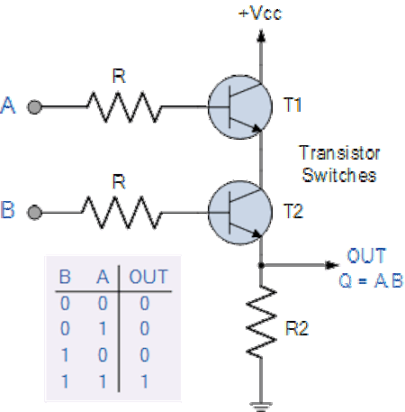
<!--How can logical AND be imeplemented. Note the difference between PN elements production process. Note that bipolar transistor are used in power-electronics due to their coef. for amplification. NMOS/CMOS transistors are used for micro processors. Bipolar transistors need much more energy. -->

---

http://www.falstad.com/circuit/circuitjs.html

---

## Закон на Мур

> Броят на транзисторите в един чип се удвоява приблизително всеки 12/18/24 месеца

Валиден ли е все още ?

<!-- Point that there is wide spread missleading information, that the law is
invalid (it will be probably in 10 years, it is not now). Intel/Samsung 14nm.
Change in materials and technology needed, though. Point that this is not a law,
but more a self-fullfiling prohpecy.-->


---

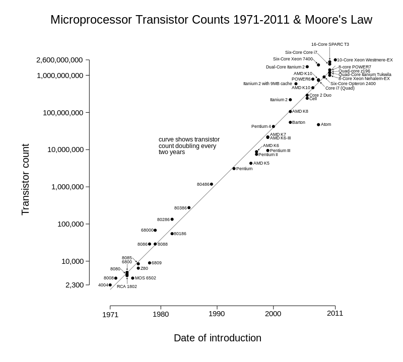

---

### Manufacturing process
1. 14nm - Intel (Skylake), Samsung (iPhone 7, 6s, Exynos Galaxy S7, S6)
2. 16nm - TSMC (iPhone 6/6s), Samsung (iPhone 6/6s). GPUs in 2016 (why so late?)
3. 22nm - Intel (Haswell), GlobalFoundries, CNSE 
4. 28nm - TSMC (AMD GCN, nVidia Kepler, nVidia Maxwell)
5. ...

** Intel 14nm != Samsung 14nm **

FinFET, new materials ..

---

MOSFET transistors


---

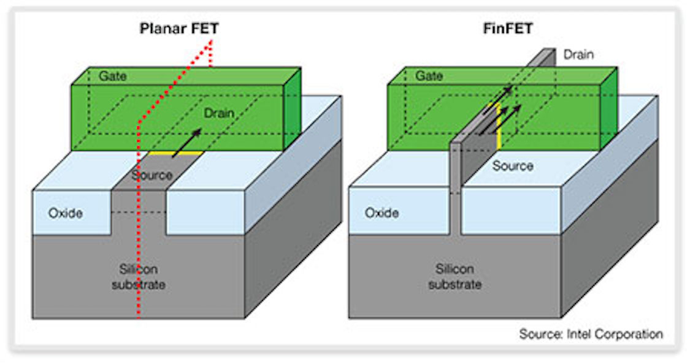

---

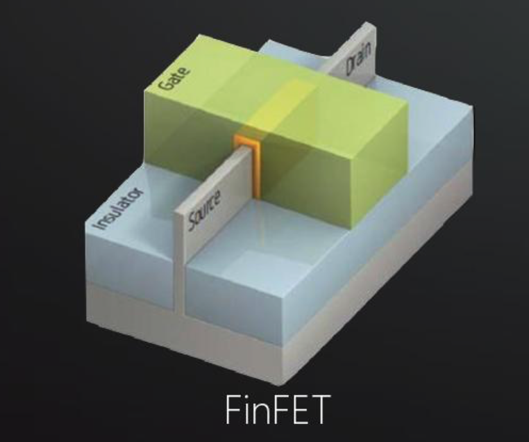

---

Да, но ...

---

Нещо се случва през 2005


<!--multiple reasons for that to happen - power wall, ilp wall, memory wall. Smartphones with 10+ cores-->

---


Защо компютрите вече не стават по-бързи ?

* Не стават ли ?

* До преди 2005 - на всеки Х месеца броят на транзисторите се удвоява по закона
  на Мур

* Това се случва посредством намаляне на размера на транзистора на чипа двойно

* Когато чипът е два пъти по-малък можем да вдигнем честотата два пъти

---

**Frequency (f)** ~ `((V - Vth)^a) / V`
___
**Power** = **Dynamic Power** + **Static Power**
___
**Dynamic Power** - energy needed to switch gate ~ 
`Capactiance (C) * Voltage ^ 2 (V^2) * Frequency (F)`
___

**Static Power** - leakage of transistors while being inactive ~ `e^(-Vth)`


<font color="gray" size="1">For sake of simplicity, these calculations are simplified to show just the parts of them, which we care about and which make the difference in our case. If you feel like you need to know the full story, please check tu-sofia.bg</font>


<!--dynamic power is the power needed to change a transistor state. Before the leakage was negligable, is not like that today. Noise also get tough on such low voltage, due to effects caused by the wires (Shannon). Note that transistor by themselves are can not be "high performance" - they do not produce anything in the end of the day.-->


---

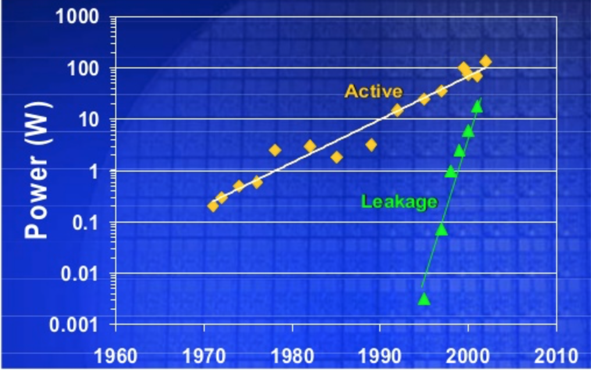

<!--when these 2 lines colide we are having troubles-->

---

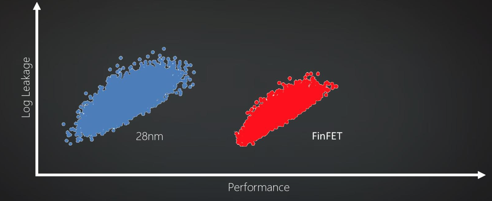

---

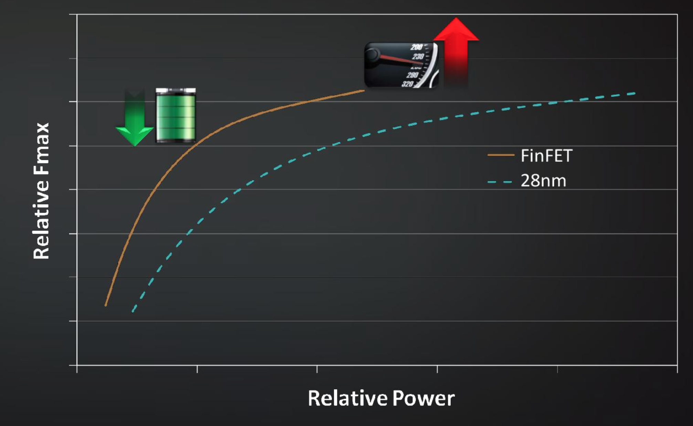

---

Ват на кв. см. в микропроцесорите

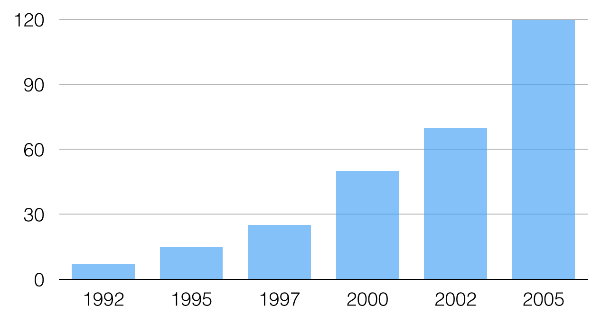

<!--another proof that the power consumption of the cpus is getting troublesome-->


---

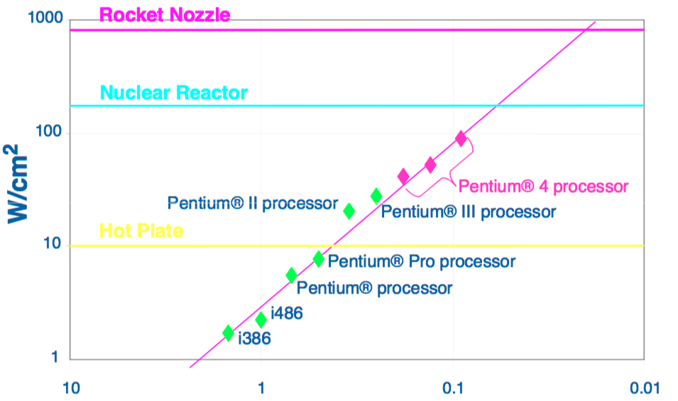

<!--another proof that the power consumption of the cpus is getting troublesome-->

---

* size **L1 = L/2**

* voltage **V1 = V/2**

* frequency **F1 = 2F**

* density **D1 = 4D**

* power = **L \* V \* V \* F **
 * **P1 = 1/2 \* (1/2 \* 1/2 \* 2 \*2 \* 2)**
 * => **P1 = P**

 Обаче ...

<!--show why there was free lunch at the first place-->

---

Поради физични явления, вече не можем да намаляме **V**. Тоест ..


* size **L1 = L/2**

* voltage  <span style="color:red;">**V1 = V**</span>

* frequency **F1 = 2F**

* density **D1 = 4D**

* power = **L \* V \* V \* F **
 * **P1 = 1/2 \* 2 \*2 \* 2**
 * => <span style="color:red;">**P1 = 4P**</span>

<!--now when we can't decrease voltage, the power consumption goes up 4 times, so we can't afford that from point-->

---

# 1. CPUs

<!--start of the sub-chapter that explains how the processor work-->

---

Straight forward:

1. Fetch
2. Decode
3. Execute
4. Write-back

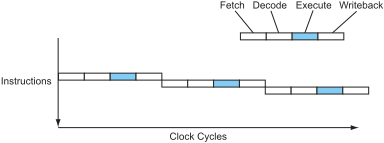

<!--start to explain how the processor works. Note that what we will show is more a mental model, since the modern processor is a bit more complicated. Point that the modern processor has more stages (12 to 30 or more) -->

---

Съществуват **точно 3 принципа**, приложими и извън програмирането, чрез които можем да получим по-голяма производителност

1. Работи по-усърдно / Work Harder

2. Работи по-умно / Work Smarter

3. Повикай помощ / Get Help

<!-- we have processor, it does what we want, now let's explore what are the ways to get more performance out of it -->

---

В контекста на процесорите:

1. Увеличена честота

2. Кешове / branch prediction / out of order / etc

3. Multicore / ILP / Auto SIMD

---

Pipeline

Do the CPU phases in parallel - write back result, as executing something else,
as decoding 3rd, as fetching 4th ..

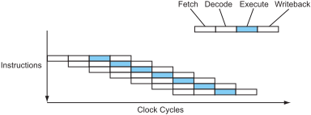

Какви проблеми може да създаде това ?
<!-- first - pipelining. Using all the stages at the same time makes the processor xN (where n = length of the pipe) faster. Different type of hazards however arise, like memory dependence, control flow hazad or structural (multiple instructions want to use the same hardware) -->


---

Resolving dependencies

```
       for (int i = 0; i < numItems; ++i) {
            x = y[i] * z;    /// <----
            q += z + x + x;
            x = a + b;       /// <----
        }

        //////////////

        for (int i =0 ; i < numItems; ++i) {
            float x0 = y[i] * z;
            q += z + x0 + x0;
            x = a + b;
        }
```
<!-- sneak peak at some of the very basic ways to resolve memory dependence. Point that the compiler most often does this for us. -->


---

Resolving dependencies in **reduction**
```
for (int i = 0; i < size; ++i)
    m = max(arr[i], m);
```
let's unroll ..
```
for (int i = 0; i <= size - 4; i+=4) {
    m = max(arr[i], m);
    m = max(arr[i+1], m); /// <----
    m = max(arr[i+2], m); /// <----
    m = max(arr[i+3], m); /// <----
}
```
Fixed:
```
m0=m1=m2=m3=-inf;
for (int i = 0; i <= size - 4; i+=4) {
    m0 = max(m0, arr[i+0]);
    m1 = max(m1, arr[i+1]);
    m2 = max(m2, arr[i+2]);
    m3 = max(m3, arr[i+3]);
}
m = max(m0, m1, m2, m3);
```
<!-- sneak peak at some of the very basic ways to resolve memory dependence. Point that the compiler most often does this for us. Some of the modern compiler can recognize reduction, unroll and vectorize for us. However, reductions are still tricky for the compilers, and it is not a bad idea to help them -->

---

let's assume we live in a perfect world, where CPUs are not power limited.

How fast can a CPU go ?

<!-- point that even if the power consumption wasn't such a problem, we still can't have the ultimate CPU. Point the difference between frequency and latency - you can send 100GHZ signal on the wire, but this doesn't change the latency of the signal -->

---

100ghz sounds fair

100ghz = 100 000 000 000 hz = 1e11hz -> 1e-11s (= 0.01ns)

Най-дългото разстояние, което може да бъде преминато за това време е 1е-11s * 300 000 km/s = 3mm

P.s. The maximal speed of electrons in Silicon is even lower - about 100 000 km/s, see 
[saturation velocity](https://en.wikipedia.org/wiki/Saturation_velocity).

---

## 3mm

Максималната честота е ограничена от скороста на най-бавният елемент в конвейра(пайплайна).

<!-- So know we know the difference between latency and frequency. Since each part of the pipeline has latency, the max frequency our CPU can go is 1/(theSlowestLatency). Otherwise at the same time we will need the hardware to do two different things. So we need to make the pipelines stages as small as we can -->

---

Superpipelined processors


Какви проблеми може да създаде това ?

<!-- So, the stages are smaller and we can run faster and this is great. However this rises the ability for hazards a lot. Also, a stall becomes more and more expensive -->

---

ILP - Instruction Level Parallelism

Super scalar processors

"Широчина на процесор"


Какви проблеми може да създаде това ?

<!-- The other way to make it fast is to get help. The processor have multiplied (parts of) the pipeline. Like 2 integer ALUs for example. This is implicit parallelism - make your code faster without you having to do anything. The wider the processor, the harder is to find what to feed it, since the pipes have to do independend stuff. ILP in the recent years (like 2015) gets better and better (4%-8% per year). -->


---

Superpipelined Superscalar Processor


<!-- Point that each modern processor today is superpipelined and superscalar.
Since all of them are, it is often to not mention the "superpipelined" word. It
is often vendors to specify how wide the cores are. There could be different
processors, for example with 1 pipe for fetch/decode/store and multiple one for
execute. They can be combined in all kinds of ways, for example one of the
execution pipes can do only float&int calcs, the other can do branch only -->

---


| Microarchitecture        | Pipeline stages           |
| ------------- |:-------------:|
| P5 (Pentium)       | 5 |
| P6 (Pentium 3)     | 10      |
| NetBurst (Willamette)   | 20      |
| NetBurst (Prescott)  | 31 |
| Core      | 14    |

Why going back to 14 ? (hint - power wall)
<!--- 13.X.2015 lecture begins here --->

---

## A (random) kind reminder:

### twitter @HPC_FMI

### github.com/savage309/HPC_FMI

---


---

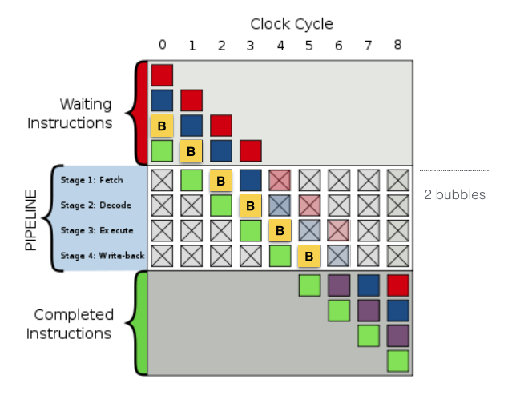

---

Resolving dependencies compile time ...

* Structural dependencies

* Data dependencies

* Controll dependencies

<!-- Talk about how pricy it is to deal with all these hazards. Think about if we can resolve them compile time. Point that due to power consumptions vendors like to turn off parts of the chips, when they are not used. Most of the hardware dealing with those hazards can not be turned off, however -->

---

* Data dependencies detection is expensive.

* Black Silicon (N.B. **SILICON != SILICONE**)

* Out of order execution
 * Examing 100's of instructions 
 * Register renaming
 * Must keep the program correctness 

---

Register spilling & usage

---

VLIW 


Old AMD GPUs

nVidia Tegra K1

Intel Itanium

Elbrus

<!--Explain what the VLIW idea is. What are the cases when it works good (simple code constructions, like game shaders). Point that every VLIW implementation so far turned out to be failure. Point the specific compiler needs they have.-->


---

Flynn taxonomy


---

1. Граница на мощността (power wall)

2. Граница на паметта (memory wall)

3. Граница на имплицитният паралелизъм (ILP wall)


<!-- At this point we have to see that we can't make processors faster, ILP
stops helping from some point due to memory hazards, bigger caches do not lead
to so much faster execution (we havent talked for caches, but we will in a few
slides).  -->

---

| Old        | New           |
| ------------- |:-------------:|
| Power is free, transistors are expensive      | Power Wall |
| Only dynamic power counts    | Static leakage is 40%      |
| Multiply is slow, load-and-store is fast | Memory wall      |
| ILP get better all the time, load-and-store is fast | ILP wall |
| Parallelization is not worth it | 75% per year before, 15% per year now    |
| Processor frequency goes up every X months | Number of cores goes up every X months      |

<!-- Point that many languages and technologies are ignoring these facts - like Python, JS, Swift. The world is not flat anymore and programmers have to change the way they code if they care for performance -->

---

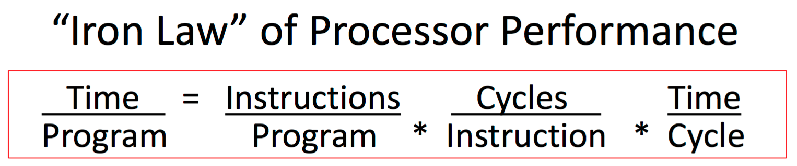

* Single core performance per year ~(2 to 15)% per year

* Multicore performance increase ~75% per year

<!-- Another proof that the Moore's Law is totally okay. These are the results from the last 5-8 years. Single core improvements are mostly due to improved architectures/ILP/etc -->

---

Hyperthreading

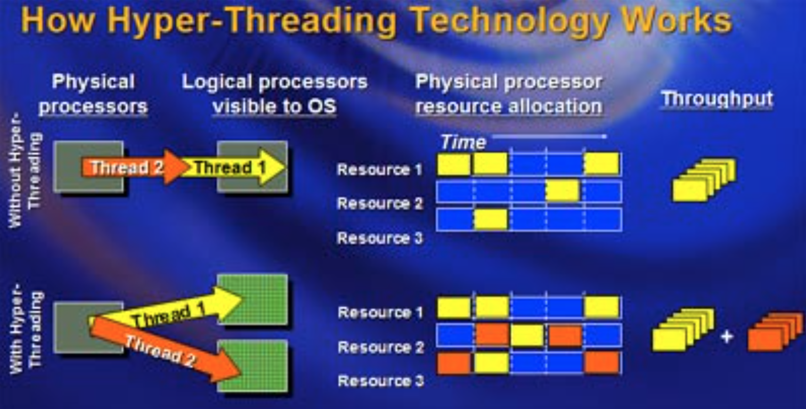

---

# 2. Memory

---

FMAD double = 50pj

Moving 64b 1mm = 25pj

<!-- We are going to caches now. Since the processors are power limited, let's see how many power it takes to move data around -->

___

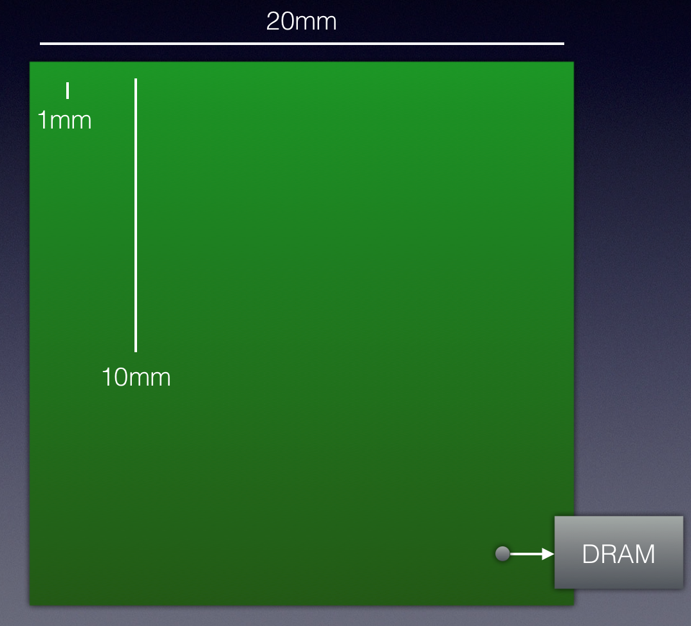

64b 10mm = 250pj

64b "off chip" = 1000pj

64b DRAM = 10000pj

12 TFLOPS ?= 300W
___

*"ALUs are like kids these days - easy to acquire, hard to feed" (B. Dally)*

<!-- point that doing 1 ALU calculation is often much cheaper than gettign the data to it. Point that many technologies (C++ included) are ignoring that fact and they are presenting the memory to the developer as it has the same access/store price.-->


---

“The Free Lunch Is Over: A Fundamental Turn Toward Concurrency in Software”
(2005, Sutter)

“30x CPU performance increases in the next 50 years” (2500x for the last 30
years)

“100 GHz CPU = Чип с размер по-малък от 1 милиметър”

**Производителност = Паралелизъм**

**Ефикасност = Локалност**

Еднонишково оптимизираните процесори (и езици!) са отрицание на това ("светът е
плосък")

<!-- All we sayed so far in resume. Make a point on the Performance=Parallelism, Efficiency=Locality. If there is one thing ppl have to remember from this course, it is that -->


---

## Производителност = Паралелизъм

___

## Ефикасност = Локалност

---

## Ефективно, ефикасно или производително ? Има ли разлика въобще ?

<!-- We are not semantic nazis, but this bugs us (at least) me a lot. Explain the difference between effective (aka has the effect you like), efficient (has the effect you like, with lower efforts) and performance (which we can think of =efficiency in our context) -->

---

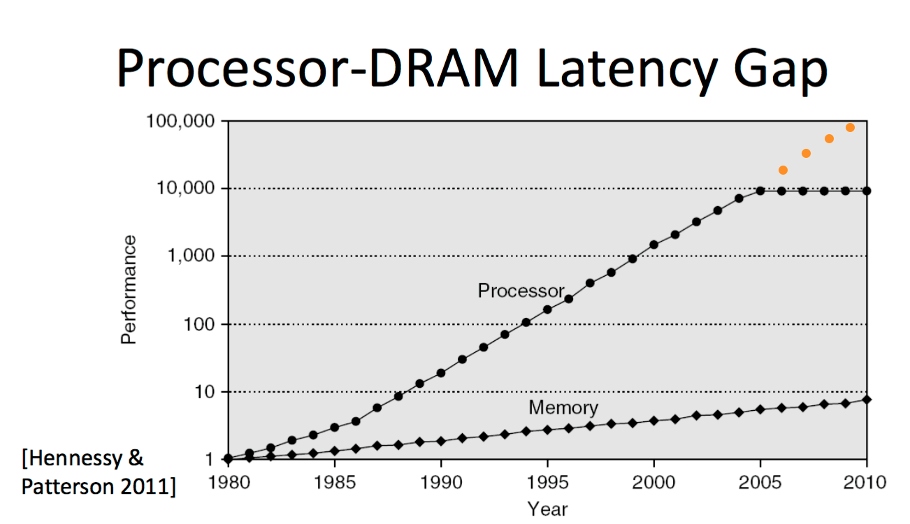

---

RAM is slow, so let's put faster caches near to the CPU

Automatically caches memory and instructions                                    
                                                                      


---

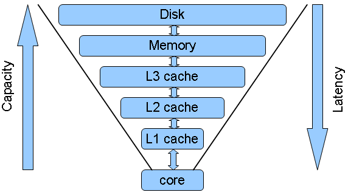

---

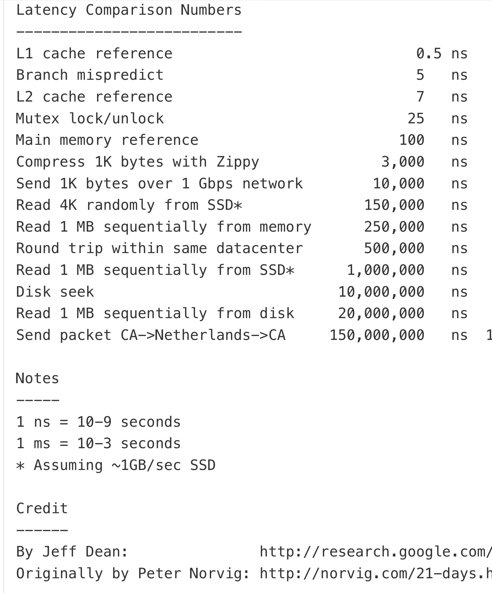

---

Why don't we put only caches ?

Speed of light - bigger the cache, longer the latency

From CPU to RAM (~30cm) and back takes 2ns !

SRAM vs DRAM vs GDRAM vs eDRAM vs HBM ?

---

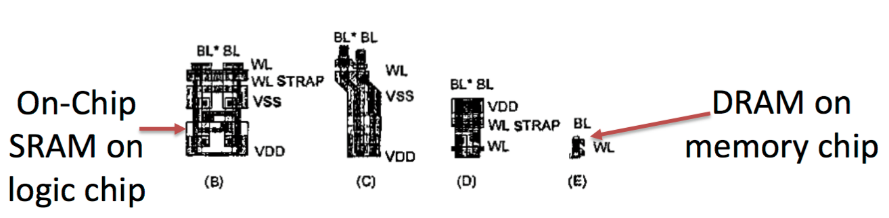


SRAM
 
 * 6 transistors
 
 * May run on CPU clocks 
 
 * Fast, but hot
 
DRAM

 * 1 transistor, 1 capacitor (production of C is nice)
  
 * Much slower (<300MHZ as of today)
 
 * Slow, but dense

---


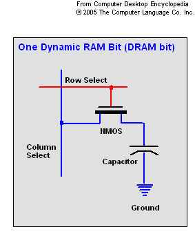

---

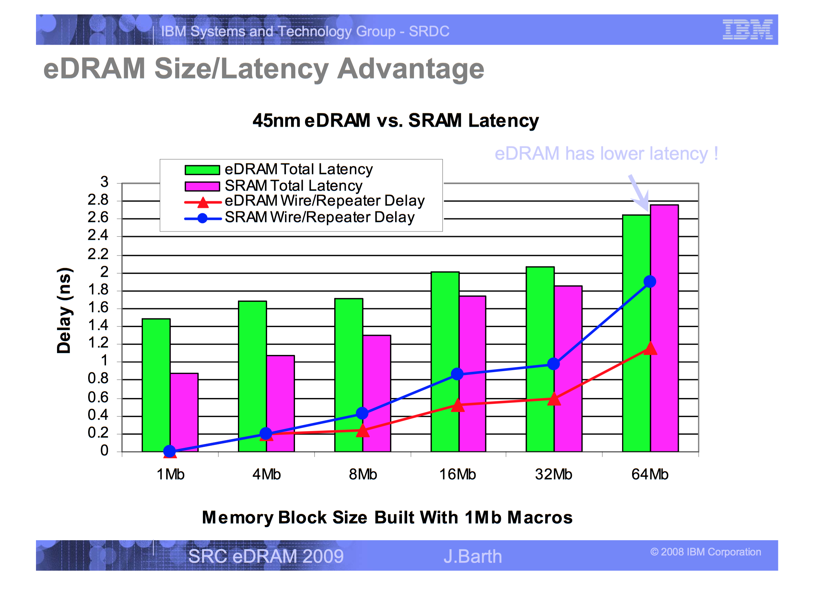

---

In a nutshel - two significantly different technologies

Both of them implemented as a 2D array (**reduce distance**)

Row & Column ID, decode. Several reads within a row are faster.

"My computer has **1033/1600/1866MHZ**, so you guys are talking about some DRAMs for the past, right?"

---

## Wrong.

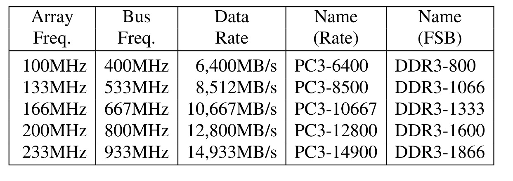

It is just marketing done well.

---

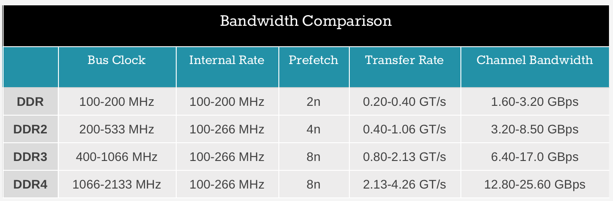

---

Cache miss
* The first time the data is being accessed
 * Prefecthing might help, more on a bit later
* Or the previous access has been evicted 
 * Reorganize data access

---

Classifying Caches

* Fully Associative

* Set Associative 

* Direct Mapped

---

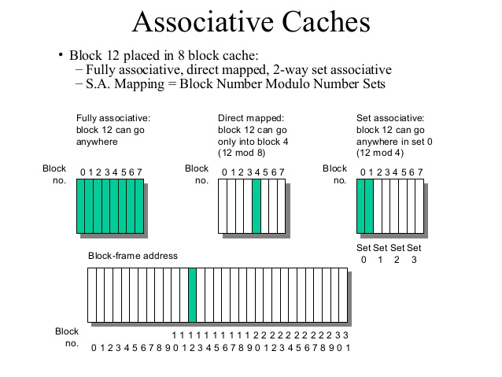

---

* Least Recently Used (LRU)
* Most Recently Used (MRU)
* Pseudo-LRU (PLRU)
* Random Replacement (RR)
* etc

---

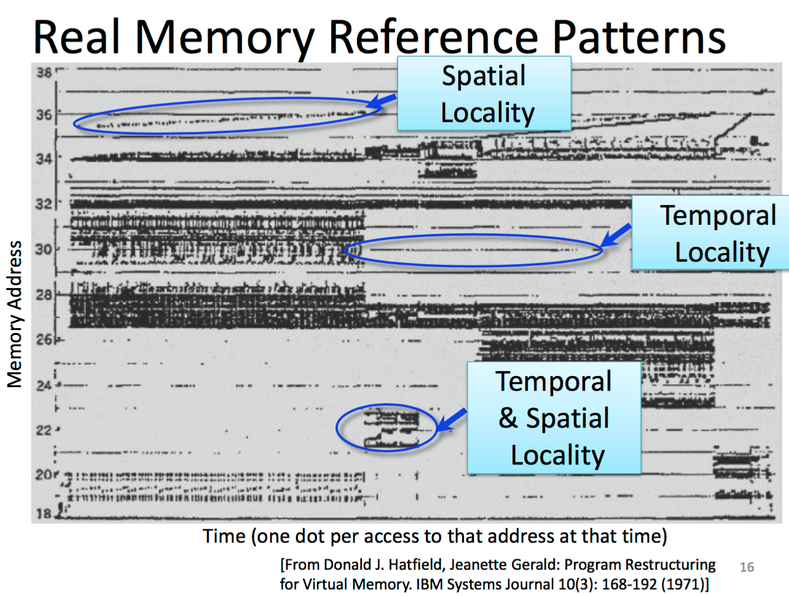

---

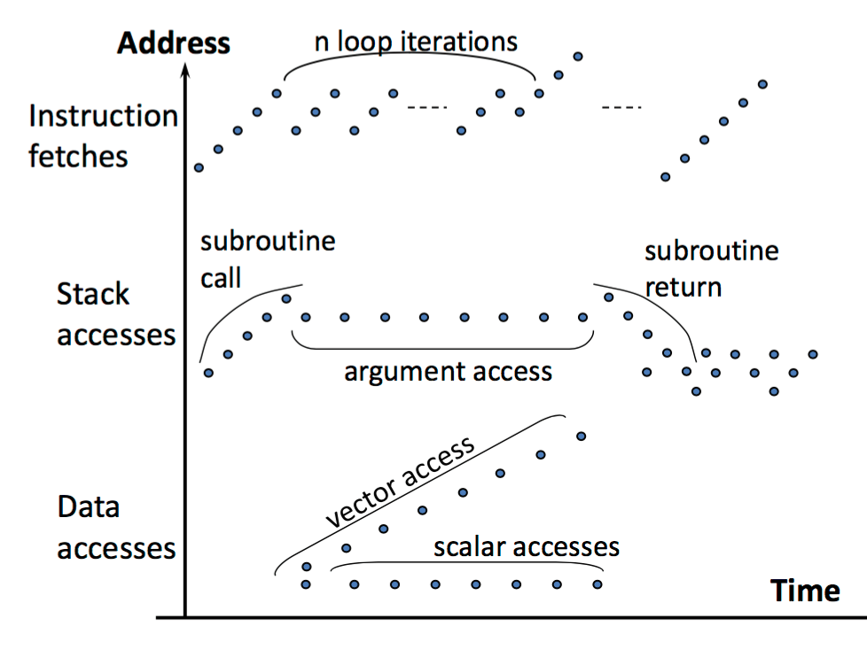

---

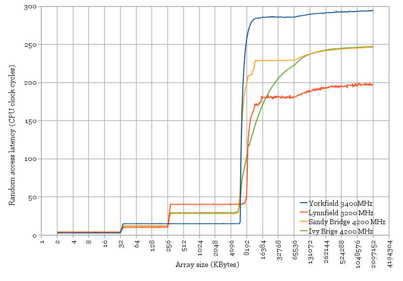

---

Prefecthing:

```
__builtin_prefetch(addr, readOrWrite, temporalLocality); 
//
void _mm_prefetch(char* p, int i);
```

Hardware prefetcher:
* Use arrays as much as possible.
* Avoid long strides.
* Use memory pools

Can this hurt the performance ?

---

Okay, so what about GDRAM and eDRAM ?

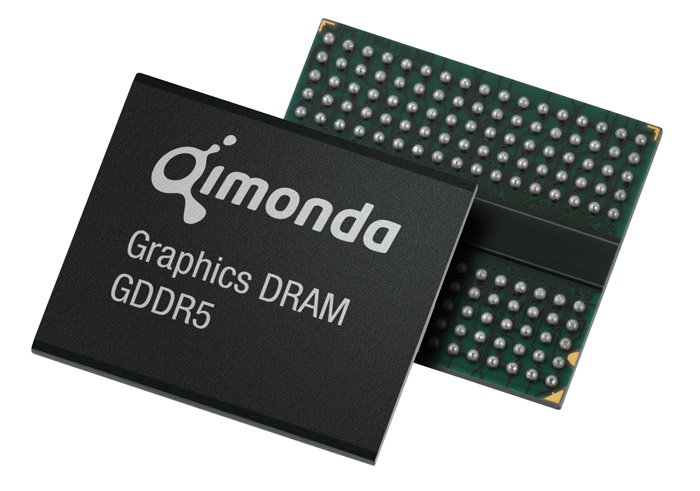

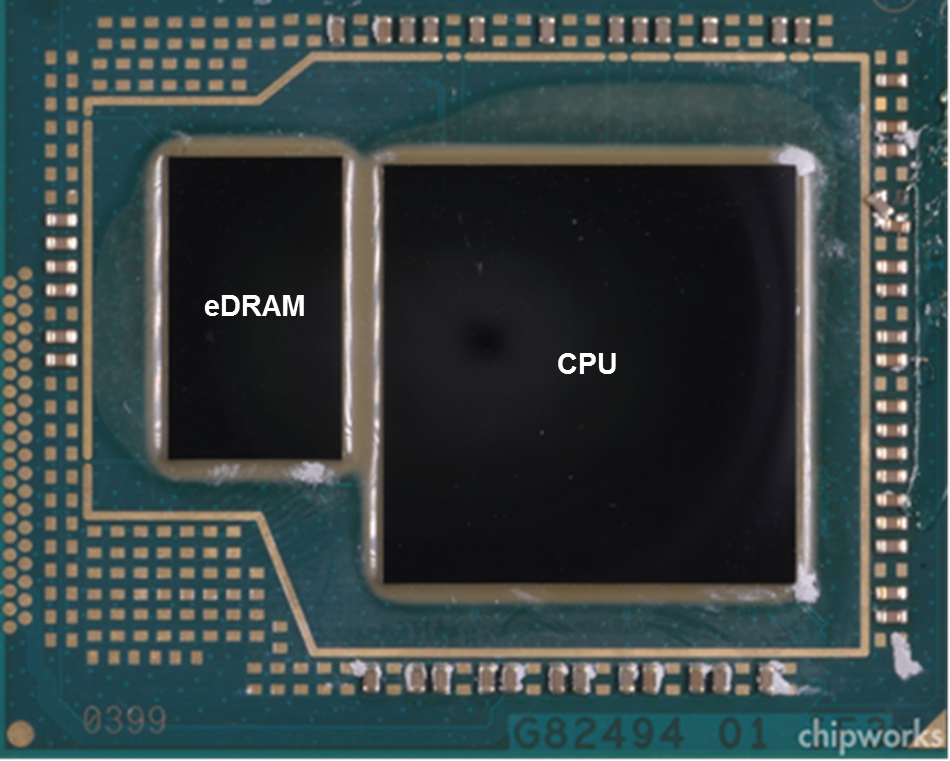

---

HBM

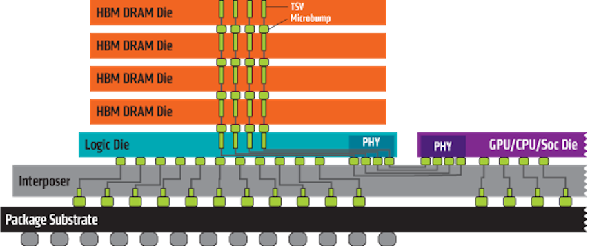

---


---

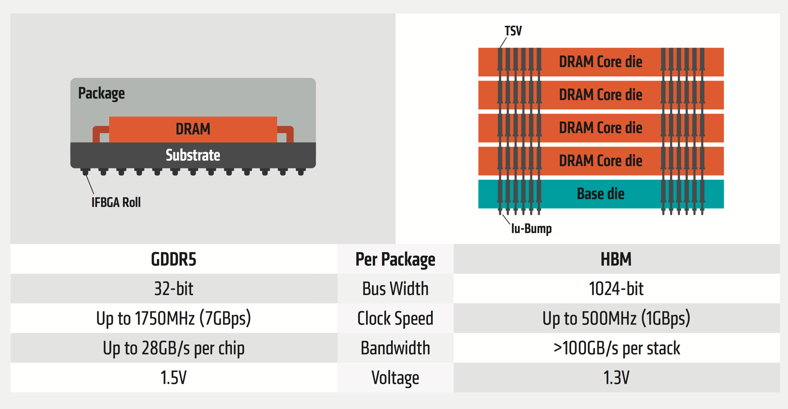

---

HBM:

1. AMD today (Fury)
2. Intel 2016 (kind of) (Xeon Phi)
3. HBM2 - nVidia 2017? (Pascal GP100)

Hynix HBM (2), Micron Memory Cube

---


---

What kind of processor do we use every day ?

* CISC
* x86-64

___

* RISC
* ARM

___

We will focus on **x86-64** + GPU architectures **GCN (Polaris)** & **Pascal (Maxwell)** 

---

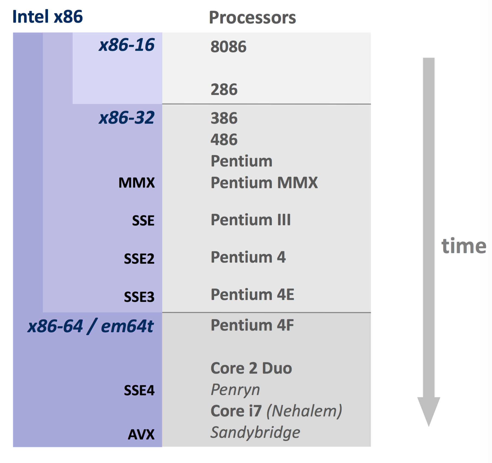

---

#Q & A

---

Note:
bonus slides in case we have time

---


### Throttling

* Power
* Thermal

Note:
bonus slides

---

What about turbo boost ?

---

http://www.falstad.com/circuit/circuitjs.html

