<!--- 20.X.2015 lecture begins here --->


## Single core optimizations


---

> Чл. 29. (1) Забранява се достъпът на работници, служители, студенти, докторанти, специализанти и всякакви други посетители с очевидни признаци за психични отклонения, употреба на алкохол или наркотични вещества до сгради и помещения на Университета.

При съмнение, ще потърсим незабавно компетентен орган ...

Ще бъде **твърде неприятно** както за вас, така и за нас.

Няма да бъде направен нито един компромис!!!

---

## Today:
* No more hardware.
 * Time to write and read real code.
* Microbenchmarks
* Compilers
* Optimizations
* If we have time:
 * Bit hacks
 * Math hacks
 * Other hacks

\+ other fun stuff

---

# Measure performance

---

`O` notation

>In mathematics, big O notation describes the limiting behavior of a function when the argument tends towards a particular value or infinity, usually in terms of simpler functions.

Describes the eventual shape of the runtime

---

The canonical forms is not that great
* `1000*(n^2)` is most-likely worse than `n^2`
* **operations count != runtime**

Does not takes into account the environment.

---

How will we measure ?

* We will care about the time a particular hardware spends to compute a given task.
 * C-function `clock()` will be good enough for our needs
 * There are other OS specific and hardware specific options (TSC, queryPerfCounter)

**Getting proper measurements is hard.**

There are two talks for that at CppCon2015!

We will have a lecture on how to use tools for profiling later.

---

* Measure enough times
 * Results should be reproducible
* Check the deviation
* Proper hardware - make sure it is not in "power save" mode, does not throttle, is not doing something else at the same time, etc.
* Be aware of the OS hacks - RAM/files might only seem released. In fact they are often released only when this is necessary.
* Restarting the machine might change the results (why?).

---

## 	(Almost) everytime something needs to be optimized, you should start with profiling.

* 90/10 rule
 * If a piece of code takes 2% of the total program execution and you make it 100 times faster, you have gained < 2%.
* If there is no "slow" function, you might have a wrong design.

---

## The result of the program should always be correct.

Otherwise we can optimize every program to work in O(1)

---

#Single core optimizations

---

## Premature optimization is the root of all evil

### But don't pessimize prematurely, too

If you wonder what your approach should be - use the one that seems to have the most common sense (especially for micro-optimizations). There is a big chance, that the compiler is already taking care (and you risk to confuse it, if you try to be smart).


---

Types of Data Hazards

Data-dependence (**Read-after-Write**):  
0. a + b -> c  
1. c + d -> e

Anti-dependence (**Write-after-Read**):  
0. a + b -> c  
1. d + e -> a

Output-dependence (**Write-after-Write**):  
0. a + b -> c  
1. d + e -> c

What about (Read-after-Read) ?

---

#[DEMO ILP]

#[DEMO CACHES]

---

Translation Look-aside Buffer (**TLB**) maintains a small list of frequently used memory pages and their locations; addressing data that are location on one of these pages is much faster than data that are not. Consequently, one wants to code in such a way that the number of pages accessed is kept low.

What is the **page size** in the modern OSs ? How it is generated ?

*If we have time today, we will check how custom allocators can affect the TLB cache performance*

---

Branch Predictor
```
if (a) {
    //...
} else {
    //...
}
```

```
eval(A)

if (!A) {
    jmp p1
}

//code A
jmp p2
p1:
... code !A
p2:
```

---

```
#if !defined(_MSC_VER) || defined(__INTEL_COMPILER)
    #define   likely(expr) __builtin_expect((expr),true )
    #define unlikely(expr) __builtin_expect((expr),false)
#endif //!defined(_MSC_VER) || defined(__INTEL_COMPILER)
```

```
while (likely(flag1 == 0)) { ... }
//
if (unlikely(x == 0)) { ... }
```

---

Pointer aliasing

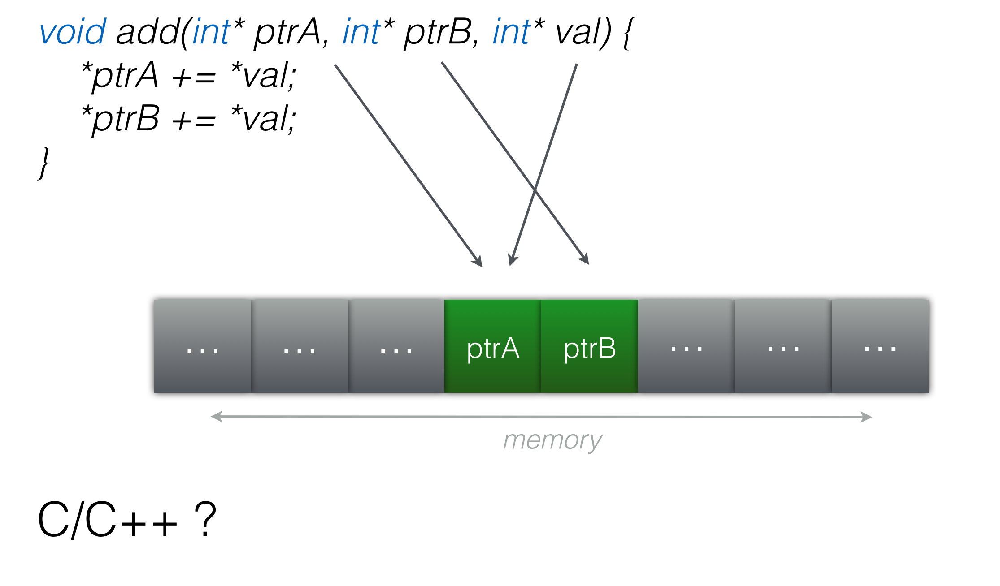

---

```
void add(int* restrict ptrA,
         int* restrict ptrB,
         int* restrict val)
{
    *ptrA += *val;
    *ptrB += *val;
}
```

C++ ? Fortran ?

Can function inlining affect that ?

---

#[DEMO POINTER ALIAS]

---

IF vs SWITCH
```
switch(i) {
    case 0: doZero(); break
    case 1: doOne();
    case 2: doTwo(); break
    default: doOther();
}
```

```
if greater, jmp to DEFAULT
compare REG to 0
if less jmp to DEFAULT
jmp to table[REG]
data table
ZERO
ONE
TWO
end data
ZERO: call doZero
jmp END
ONE: call doOne
TWO: call doTwo
jmp END
DEFAULT: call doDefault
END:
```

---

Sometimes compiler makes jump table from `if`s too.

As usual, if this is really important, don't trust the compiler and code the jump table by yourself.

---

```
float a, bool b;
/* */
a = b ? 42.0f : 196.0f;
```

```
float a, bool b;
/* */
static const float lookup[] = {42.0f, 196.f};
a = lookup[b];
```

---

ifs can be sometimes reduced

```
T& at(int i) {
    if (i < 0 || i >= size) {
        /* */
    }
    /* */
}
```

```
T& at(int i) {
    if (unsigned(i) >= unsigned(size)) {
        /* */
    }
    /* */
}
```

```
//check in bound
unsigned(i - min) <= unsigned(max - min)
```

---

What about i++ vs ++i ?

```
self_type operator++() {
    self_type i = *this;
    ptr_++;
    return i;
}

self_type operator++(int junk) {
    ptr_++;
    return *this;
}
```

Usually doesn't matter, compiler are often smart.

But go for **`++i`**.

---

#Question:


**Which is faster `a[++i]` or `a[i++]` ?**

Hint: think dependencies ...

---

What about **`*`** vs **`/`**

```
volatile float f = 196.f;
float y = f / 2.f;
float z = f * .5f;
```
Well, it depends on the compiler options (so check the compiler manual).
```
movss  -0x14(%rbp), %xmm2
divss  %xmm1, %xmm2       ; <---
movss  %xmm2, -0x18(%rbp)
movss  -0x14(%rbp), %xmm1
mulss  %xmm0, %xmm1
```

```
movss  0x50(%rip), %xmm1
mulss  %xmm1, %xmm0      ; <---
movss  -0x4(%rbp), %xmm2
mulss  %xmm1, %xmm2
```

---

```
volatile float a = 196.f;
volatile float f = pow(a, 2.0); //how about pow(a, 2.1) ?
```

```
movss  -0x4(%rbp), %xmm0
mulss  %xmm0, %xmm0
movss  %xmm0, -0x8(%rbp)
```

```
movsd  0x64(%rip), %xmm1
movq   %rax, -0x20(%rbp)
callq  0x100000f58               ; symbol stub for: pow
```

Most of the time compiler does a great job.

---

```
double myPow10(double x) {
    const double x2 = x * x;
    const double x4 = x2 * x2;
    const double x8 = x4 * x4;
    const double x10 = x8 * x2;
    return x10;
}
```

---

Inlining is the root of all optimizations

```
void changeSaturation(T *R, T *G, T *B, T change) {
    T P=sqrt(
        (*R)*(*R)*Pr+
        (*G)*(*G)*Pg+
        (*B)*(*B)*Pb ) ;

    *R=P+((*R)-P)*change;
    *G=P+((*G)-P)*change;
    *B=P+((*B)-P)*change;
}
```

```
float r, g, b, c;
r = g = b = c = 0.f;
changeSaturation(&r, &g, &b, &c);
printf("%f\n", r + g + b + c);
```

---

#[DEMO INLINING]

---

Most matter for the compiler optimizer, but also faster.

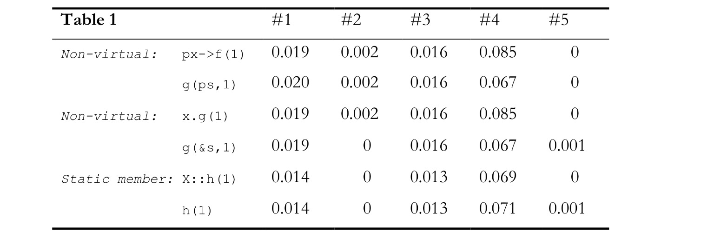
<!--- tables from "Technical report on C++ Performance" --->

---

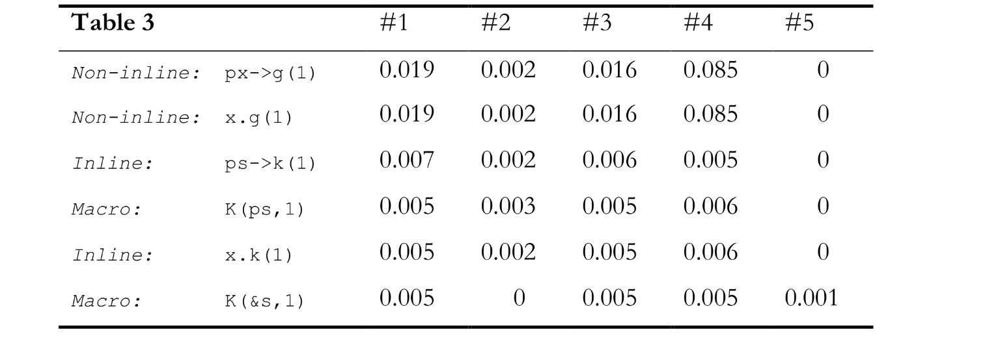

---

So why just don't we inline everything ?


---

All of this - caches, branch predictor, out of order execution, register renaming, etc is done to hide the latency to the memory.

Are there any other completely different approaches ?

---

Everything in a small functions?

- what about performance?

---

#COMPILERS

---

Compilers

* cl (MSVS)

* icc (Intel)

* gcc

* clang

* others

<!---
Note (from www.agner.org, optimizing_cpp.pdf):

Microsoft Visual Studio  
This is a very user friendly compiler with many features, but also very expensive. A limited "express" edition is available for free. Visual Studio can build code for the .NET framework as well as directly compiled code. (Compile without the Common Language Runtime, CLR, to produce binary code). Supports 32-bit and 64-bit Windows. The integrated development environment (IDE) supports multiple programming languages, profiling and debugging. A command-line version of the C++ compiler is available for free in the Microsoft platform software development kit (SDK or PSDK). Supports the OpenMP directives for multi-core processing. Visual Studio optimizes reasonably well, but it is not the best optimizer.

Borland/CodeGear/Embarcadero C++ builder  
Has an IDE with many of the same features as the Microsoft compiler. Supports only 32-bit Windows. Does not support the SSE and later instruction sets. Does not optimize as good as the Microsoft, Intel, Gnu and PathScale compilers.

Intel C++ compiler (parallel composer)  
This compiler does not have its own IDE. It is intended as a plug-in to Microsoft Visual Studio when compiling for Windows and to Eclipse when compiling for Linux. It can also be used as a stand alone compiler when called from a command line or a make utility. It supports 32-bit and 64-bit Windows and 32-bit and 64-bit Linux as well as Intel-based Mac OS and Itanium systems.  
The Intel compiler supports vector intrinsics, automatic vectorization (see page 107), OpenMP and automatic parallelization of code into multiple threads. The compiler supports CPU dispatching to make multiple code versions for different CPUs. (See page 130 for how to make this work on non-Intel processors). It has excellent support for inline assembly on all platforms and the possibility of using the same inline assembly syntax in both Windows and Linux. The compiler comes with some of the best optimized math function libraries available.    
The most important disadvantage of the Intel compiler is that the compiled code may run with reduced speed or not at all on AMD and VIA processors. It is possible to avoid this problem by bypassing the so-called CPU-dispatcher that checks whether the code is running on an Intel CPU. See page 130 for details).   The Intel compiler is a good choice for code that can benefit from its many optimization features and for code that is ported to multiple operating systems.

Gnu  
This is one of the best optimizing compilers available, though less user friendly. It is free and open source. It comes with most distributions of Linux, BSD and Mac OS X, 32-bit and 64-bit. Supports OpenMP and automatic parallelization. Supports vector intrinsics and automatic vectorization (see page 107). The Gnu function libraries are not fully optimized yet. Supports both AMD and Intel vector math libraries. The Gnu C++ compiler is available for many platforms, including 32-bit and 64-bit Linux, BSD, Windows and Mac. The Gnu compiler is a very good choice for all Unix-like platforms.

Clang  
The Clang compiler combined with the LLVM is a new compiler which is similar to the Gnu compiler in many respects and highly compatible with Gnu. It is expected to replace the Gnu compiler on the Mac platform, but also supports Linux and Windows platforms. The Clang compiler is a good choice for all platforms.

PathScale  
C++ compiler for 32- and 64-bit Linux. Has many good optimization options. Supports parallel processing, OpenMP and automatic vectorization. It is possible to insert optimization hints as pragmas in the code to tell the compiler e.g. how often a part of the code is executed. Optimizes very well. This compiler is a good choice for Linux platforms if the bias of the Intel compiler in favor of Intel CPUs cannot be tolerated.
--->

---

## CPU dispatching:

* GCC
* Intel
 ```
__intel_cpu_feature_indicator ///CPU features bitmask
__intel_cpu_feautres_init_x();
```
* Others
 * Check the manual

---

* Optimizations vs No-Optimizations ( **-O** )
 * By default, on most compilers they are **off**.
* `./gcc -O3 -mSSE2 -m64`
* Usually `-O0` turns optimizations off
 * Check the compiler manual !

---

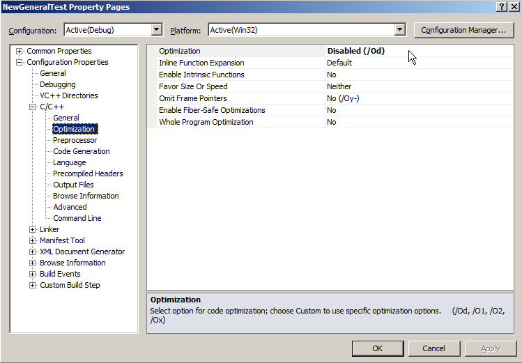

---

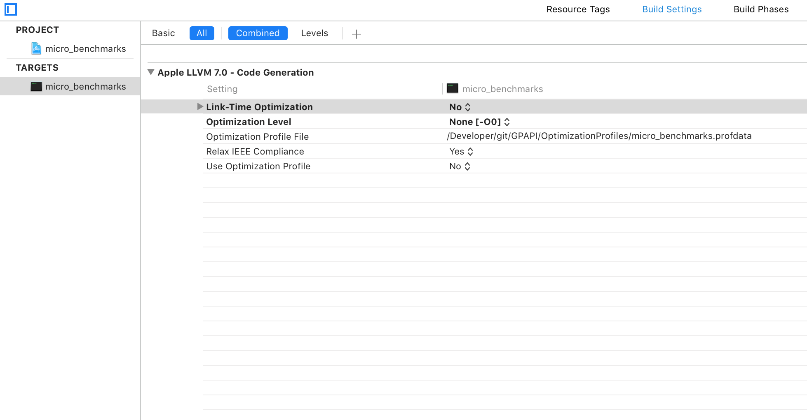

---

What about linking between libraries build from different compilers ?
 * **clang & icc** are living secret double live for quite some time

---

What about linking between libraries build form different version of the same compiler ?
 * Windows (vc8, vc9, vc91, vc101, vc11)
 * Linux (libstdc++)
 * OS X (libstdc++)

---

Compiler optimized code:
* Runs much faster
* Takes more time to compile
* Can't be debugged with IDE
 * It will generally work, but you will **debug garbage**

---

Rule of thumb:
* **always** do benchmarks with optimizations **on**
* **always** debug with optimizations **off**.

---


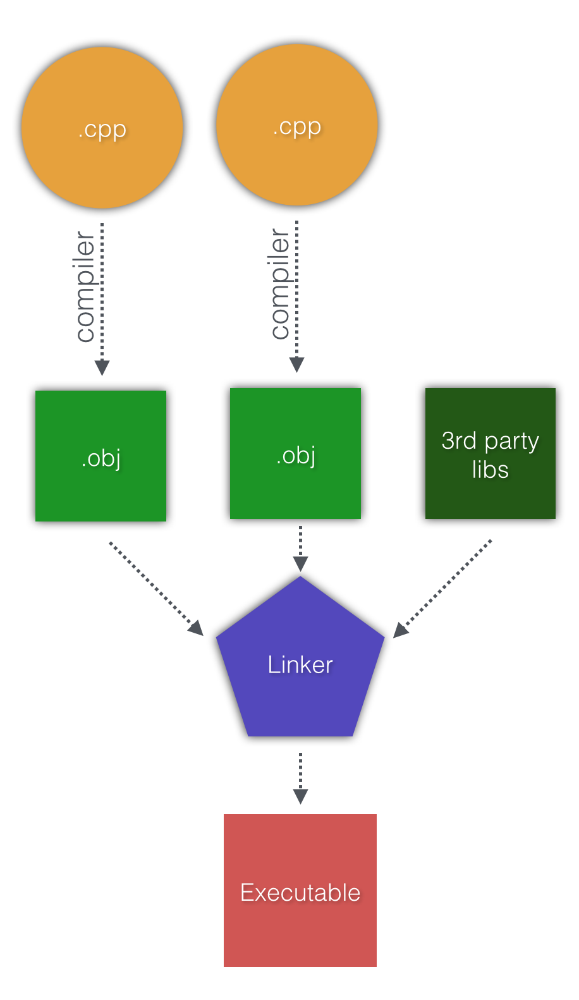

---

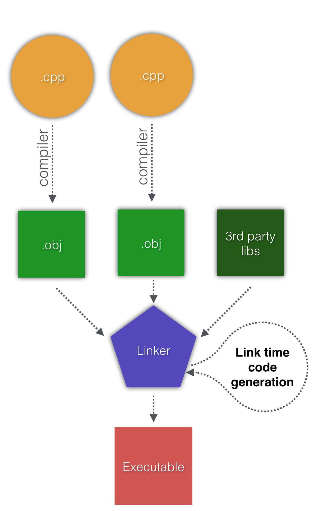

* Link time code generation

* Whole program optimization

* Link Time Optimization


---


All in one cpp

```
//file unity_build.cpp
#include "first.cpp"
#include "second.cpp"
//...
#include "last.cpp"
```

Pros : 0 link time, fast compilation, possibly faster code (why?)

Cons : compiler has a limit too (and most are single threaded), hard to maintain


<!--- 27.X.2015 lectures starts here --->


---

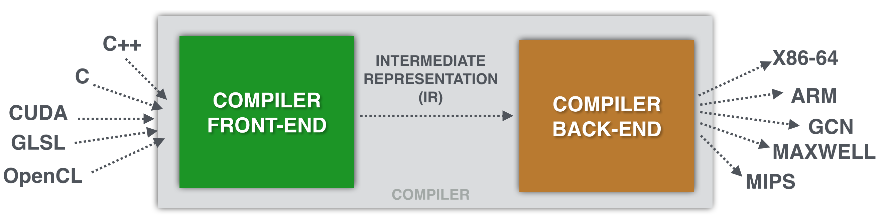

---

Memory alignment
```
for (int i = 0; i < 4096; ++i) {
    printf("%p\n", new int);
}
```

```
template <typename T>
struct Node {
    T* left; T* right;
    bool something, somethingElse;
};

template<typename T>
struct Node {
T* left, right;
Т* getLeft() const { //make getRight() too
    T* tempPtr = left;
    setFlag(tempPtr, 0, 0);
    setFlag(tempPtr, 1, 0);
    return tempPtr;
}
bool getSomething() const { return getFlag(left, 0); }
bool getSomethingElse() const { return getFlag(left, 1); }
void setSomething(bool foo) { setFlag(left, 0, foo); }
void setSomethingElse(bool foo) { setFlag(left, 1, foo); }
};
```

---

Log, Leak and Leave @ Facebook

---

We have to reset the last 2 bits every time when we use the ptr.

Some architectures are **ignoring** them.

---

To `const` or not to `const` ?

```
float temp = a + b;
for (int i = 0; i < size; ++i)
    fooBar(temp)
```

```
const float temp = a + b;
for (int i = 0; i < size; ++i)
    fooBar(temp)
```

---

It doesn't matter for the compiler

(the compiler knows better than you what is `const` and what is not)

**const** could however make the code safer, so use it

What about namespaces ? Ref(&) vs Ptr(*) ?

When we add new function to a class, does its objects get bigger ? What if it is virtual ?

---

```
const float input[] = { 1, 2, 3, 4, 5, 6, 7, 8, 9, 10, 11, 12, 13, 14, 15, 16 };
float output[COUNT_OF(input)];
int main(int, char**) {
    for (size_t i = 0; i < COUNT_OF(input); ++i)
        output[i] = input[i] + input[i];
}
```

```
float input[] = { 1, 2, 3, 4, 5, 6, 7, 8, 9, 10, 11, 12, 13, 14, 15, 16 };
float output[COUNT_OF(input)];
int main(int, char**) {
    for (size_t i = 0; i < COUNT_OF(input); ++i)
        output[i] = input[i] + input[i];
}
```
Note:
"""По подразбиране глобалните детерминистично-инициализирани (т. е. ненулеви, със съдържание известно към момента на компилация) ПОД декларации се разполагат в една от двете ELF секции за предварително-инициализирани данни - така наречените .rodata (read-only-data, за константи) и .data (за променливи). Това са секции, които съдържат в себе се данни, известни още при създаването на файла - т. е. литерали и резултати от детерминистични изрази. Към момента на зареждане за изпълнение тези данни се разполагат в непроменен вид в адресното пространство на процеса. За разлика от тях, глобалните декларации на пълноценни обекти, които се инициализират от конструктори, и на ПОД данни със съдържание неизвестно към момента на компилация, се алокират в така наречената .bss (block started by symbol) секция, която изцяло се нулира при зареждането на процеса, и където декларациите получават инициализирането си непосредствено преди управлението да бъде предадено на main(). На същото място се намират и неинициализираните (т. е. инициализиран с нули) глобални и статични локални ПОД декларации. Тоест, глобалните константни обекти живеят заедно с глобалните променливи в .bss. Важното е да отбележим разделителната линия между константите в .rodata и тези в .bss - в единия случай компилаторът може да направи достоверно предвиждане за съдържанието на константните глобални декларации към момента на ползването им в кода ни поради детерминистичност на съответните инициализации, докато в другия информацията се попълва едва по време на изпълнение, и компилаторът трябва да прави предположения относно съдържанието на такива декларации към момента на употребата им. Но каква е ролята на константния декоратор при глобалните декларации? Доста съществена - той може да направи декларацията недостъпна за промени не само от нашия код (т. е. класическото значение на const декоратора в C), но и в контекста на целия процес. Именно по тази причина детерминистичните ПОД константи се разполагат в секцията .rodata, която гарантира неприкосновенноста на съдържанието за цялото времетраене на процеса - тази секция се помещава в страници достъпни само за четене. Добре, ако константният декоратор на глобални декларации има семантика, която позволява на компилатора да направи декларираните данни неоспорими константи за процеса, то какво пречи на компилатора да вгради същите тези константи, както и резултатите от всякакви детерминистични изрази с тях, като непосредствени операнди в кода? Ами нищо.""" М. Кръстев.

---

```
typedef const float (& immutable_array_of_16_floats)[16];
struct InputArray {
    float array[2];
    InputArray() { array[0] = 1; array[1] = 2; }
    operator immutable_array_of_16_floats () const {
        return array;
    }
};
const InputArray input;
float output[2];
int main(int, char**){
    for (size_t i = 0; i < COUNT_OF(input); ++i)
        output[i] = input[i] + input[i];
}
```

---

```
#include <iostream> //malloc(196);
typedef const float (& immutable_array_of_16_floats)[16];
struct InputArray {
    float array[2];
    InputArray() { array[0] = 1; array[1] = 2; }
    operator immutable_array_of_16_floats () const {
        return array;
    }
};
const InputArray input;
float output[2];
int main(int, char**){
    for (size_t i = 0; i < COUNT_OF(input); ++i)
        output[i] = input[i] + input[i];
}
```

---

#DEMO [CONST PROP]

---

LLVM coding style guide


```
#include <iostream>

std::cout << "Hello world";
```


>The use of #include <iostream> in library files is **hereby forbidden**

Why ?

---


```
float x, y, z;
x = atan2(e0, e1);
y = atan2(e0, e1);
z = atan2(e0, e1);
```

Is there a problem with that ?

```
for (int i = 0; i < size; ++i) {
    //..
    x += sinf(y);
    //...
}
```

```
std::string str("HPC FMI");
str.length(); //how fast is that ?
```

---

O(n^2)
```
for (int i = 0; i < strlen(str); ++i)
    str[i] = toLower(str[i]);
```

O(n)
```
auto len = strlen(str);
for (int i = 0; i < len; ++i) {
    str[i] = toLower(str[i]);
}
```

---


What about **virtual** ? How is it implemented ?

Usually compiler transfer **foo.bar()** to [jump] and **foo.x** to [addr + offsetof(x)]. Where should virtual jump is known runtime only.

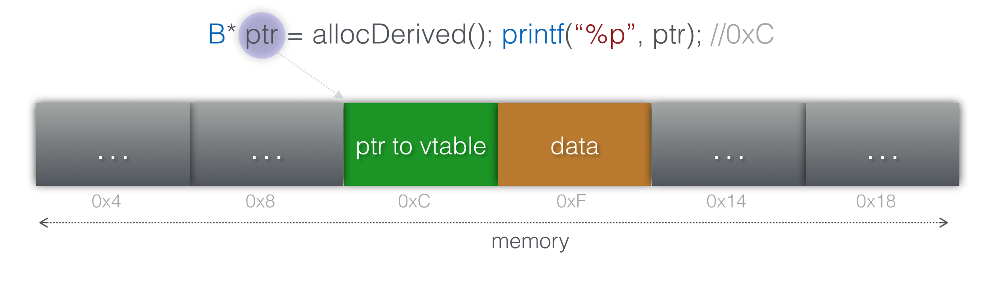

---

**1st 64bit** used for pointer to vtable (= cache miss)

can't be inlined (since what has to be executed is know only runtime)

The vptr may be re-written multiple times

There may be multiple vptrs

---

```
#define SLOW virtual
class Bar {
    SLOW void test() const;
};
```

The **virtual** keyword is fundamental for OOP.

Think **twice**     before using OOP (more on that after few weeks)

If you have array of Object*, it might make sense to sort it by dynamic type (icache works much better)

Note:
Today, it is not uncommon for software teachers to recommend that no function or method should be longer than a few lines. A few decades ago, the recommendation was the opposite.
As a bonus, check curiously recurring template patterns https://en.wikipedia.org/wiki/Curiously_recurring_template_pattern

---

#[DEMO VIRTUAL]

---

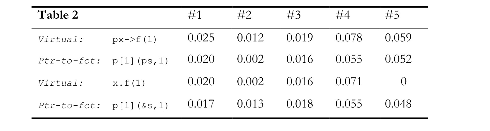

---

Devirtualizer

```
struct A {
    virtual int foo (void) {return 42;}
};
int test() {
    struct A a, *b=&a;
    return b->foo();
}
```

Inlining + Constant propagation + Dead code removal + Inliner + Dead code removal

```
int test() () {
    return 42;
}
```

Note:
```
typedef int (PFUNC)(int);

int func1(int x) {
return x + 100;
}

int func2(int x) {
return x + 200;
}

int test0(PFUNC f) {
return f(3);
}

int test1(PFUNC f) {
//compiler may check how often they are being called (profile counts)
if (f == func1) return func1(3);
if (f == func2) return func2(3);
return f(3);
//results in speculative devirtualization
```

---

## Casts

* How is `static_cast<T*>` implemented ?
 * Does it cost something ?
 * Can it change the addres of the ptr ?
```
float* a = static_cast<int*>(b);
```
```
Widget* a = static_cast<Gadget*>(b);
```

* How is `dynamic_cast<T*>` implemented ?
 * Linux `RTLD_GLOBAL`

---

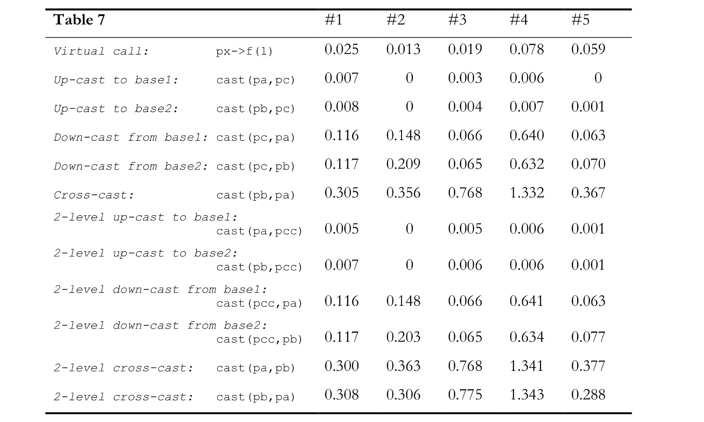

Depends on *many* factors, but likely >10 times slower than virtual call

---

#STD SORT CASE STUDY

---

```
__restart:
difference_type __len = __last - __first;
switch (__len) {
    case 0: case 1:
        return;
    case 2:
        if (__comp(*--__last, *__first))
            swap(*__first, *__last);
        return;
    case 3:
        _VSTD::__sort3<_Compare>(__first, __first+1, --__last, __comp);
        return;
    case 4:
        _VSTD::__sort4<_Compare>(__first, __first+1, __first+2, --__last, __comp);
        return;
    case 5:
        _VSTD::__sort5<_Compare>(__first, __first+1, __first+2, __first+3, --__last, __comp);
        return;
    }
// const difference_type __limit = is_trivially_copy_constructible<value_type>::value && is_trivially_copy_assignable<value_type>::value ? 30 : 6;
    if (__len <= __limit) {
        _VSTD::__insertion_sort_3<_Compare>(__first, __last, __comp);
        return ;
    }
    //etc
```

---

32bit vs 64bit CPUs


---

Conclusion

* Single threaded performance is not getting any faster

* In the past it was hard to make complex app, but it was getting faster year after year.

* Now, sophisticated apps are easier to make (use SophisticatedApp.js (.go?)). Fast apps are *not*.

* Most of the people think that the computers are so fast, that there is no point in in-depth optimizations. As we saw, it is exactly *the opposite*.

* You need max performance per thread, use all the threads & use any extra compute units if you want to do more.

---

# Q & A

---

Note:
Since I am not sure how much time the above will take, some bonus slides in case we finish up quickly

---

What about Exceptions ? RTTI ? __fastcall ?

---

## Exceptions

- (Probably still) Slow on Windows
- Larger executable
- Forbidden (Very very bad style) on consoles
- turned off by default for Android

---

## Exceptions contd.

* Code approach
* Table approach

```
class Foo { 
    ///
    ~Foo() { /* */ }
};

void bar {
    Foo foo;
    /* exception, who calls the d'tor ? */
}
```

---

## Exceptions contd.

* Alternatives ?
 * Return code
 * Global error state indicator (errno)
 * Calling error handle funciton
 * goto 
 * Input/output pointer to variable to each function

---

## RTTI

- `dynamic_cast` won't work if disabled
- `typeid` is so broken, that it is useless

---

## __fastcall

* No effect what so ever on x86-64

---

Prefer x86-64 vs x86

**Why ?**

Why is the first 64bit iPhone faster than the last 32bit iPhone ?

---

Prefer 32bit ints to all other sizes
* 8, 16bit usually are using convertion to 32 bit and back
* If you use flags, compiler heuristics might think that you need memory, not performance

---

| Instruction        | ~Cycles            |
| ------------- |:-------------:|
| sqrt| 30 |
| div | 40 |
| sin | 100 |
| cos | 100 |
| sincos | 150 |
| log | 150 |
| mul | 4   |

---

Speed hierarchy:
* comparison
* integer add, sub, bitops, shift
* FP add, sub
* int mul, FP mul
* FP div, remainder
* int div, remainder

FP div is faster than int div !

Will see why this matters in a few slides ...

---

Conversations

* integer - intger: basically free
* float - double: pricey
* int - float: pricey
* float - int: very pricey

---

#BIT HACKS

---

```
//actually slower
//why ?
void swapXOR(int& a, int& b) {
    a = a ^ b;
    b = a ^ b;
    a = a ^ b;
}
//(x ^ y) ^ y = x
//--------------------------------------------
//|input    | 0        | 1        | 2        |
//|------------------------------------------|
//|10111101 | 10010011 | 10010011 | 00101110 |
//|00101110 | 00101110 | 10111101 | 10111101 |
//|-------------------------------------------
```

---

```
//unpredictable branch?
int min0(int x, int y) {
    if (x < y)
        return x;
    return y;
}

//if x < y, -(x<y)=-1, which is all ones in two's complement represent => y^(x^y)=x
//4 cycles = L1 cache access
int min1(int x, int y) {
    return y ^ ((x^y) & - (x < y));
}
```

---

```
int mod0(int x, int y, int n) {
    return (x + y) % n;
}

// (x + y) mod n, 0 <= x < n, 0 <= y< n
int mod1(int x, int y, int n) {
    int z = x + y;
    //unpredictable branch
    return r = (z < n) ? z : z - n;
}

int mod2(int x, int y, int n) {
    int z = x + y;
    //same as minus
    return z - (n & - (z >= n));
}
```

---

```
int roundUpToPowerOf2(int64_t n) {
    // 10010
    //in case if power of 2, decrement
    --n;         // 10001
    n |= n >> 1; // 11001
    n |= n >> 2; // 11101
    n |= n >> 4; // 11111
    n |= n >> 8; //
    n |= n >> 16;//
    n |= n >> 32;//
    ++n;         //100000
    return n;
}
```

---

Quiz:

* How to find if a variable is on the stack or on the heap ?

* What is the overhead of the RAII pattern ?

---

# Common optimization approaches

---

If you have to have sentinel integers, prefer 0, 1.

```
enum {
    Invalid = -1,
    Success = 0,
    Error = 1,
};
```

vs

```
enum {
    Invalid = 100,
    Success = 200,
    Error   = 300,
};
```

Sometimes comparing with **0, 1** is faster.

Note:
https://www.youtube.com/watch?v=ea5DiCg8HOY

---

Caching

 * Function is expensive
 * Function is heavily used
 * Argument space is small
 * Results only depend on arguments
 * Function has no side effects
 * Function is deterministic

---

Lazy evaluation

* Only a few results of a large computation is needed
* Accessing the result can be done by a function call
* All that needed to calculate the results will remain unchanged

---

Packing

* If space is more important
* More of an old-days techinique

---

```
int data[SIZE + 1];
int find(int val) {
    data[SIZE] = val;
    while (data[i] != val)
        ++i;
    return (i == SIZE) ? -1 : i;
}
```

---

#MATH

---


---

| Before        | After            |
| ------------- |:-------------:|
| sqrt(x) > 0     | x > 0|
| sqrt(x\*x+y\*y) < sqrt(z\*z + w\*w)  | x\*x + y\*y < z\*z + w\*w     |
| log(A) + log(B) | log(A\*B)      |

---

```
return a * 4; // leaq 0(.%rdi, 4), %rax
//
return a * 43; // leaq (%rdi, %rdi, 4), %rax ; a+4*a = 5a
               // leaq (%rdi, %rax, 4), %rax ; a+4*5*a = 21a
               // leaq (%rdi, %rax, 2), %rax ; a+2*21a

```

Mult by 2/4/8 is part of the addresing mechanism (read, is **fast**)

---

What generally should be avoided ?

* *Many heap allocations*
* Function calls (virtual, function ptrs)
* Upredictable branches
* Large switch statements
* Loops with exits and breaks
* Loops with unknown bounds (pragma can help)
* Memory access is assumed to have possible side effects

---

### Many heap allocations contd.

```
//main loop
for (int i = ...; ...; ...) {
    std::vector<int> v = processResult(...);
    /* */
}

```

Fix ?
```
template <typename T>
struct LocalVector { 
    static_assert(sizeof(T) <= 8);
    T data[64]; 
}
```

---

Sadly, **STL**

* First and foremost, because of the ABI

* Second
 * It is too general in some cases (atomic counters).
 * This makes it slow. And it lacks stuff, too.
 * It is inconsistent even between minor compiler versions.
 * And, to be honest, it is not fun to use.
* Boost ?
 * No.
 * It is the same as STL.
* Most people use their in-house libraries ...


---

## Summary

- inlining is your best fried
- NO virtual
- prefer specialized algorithms vs generic ones
- prefer specialized containers vs generic ones

---

# OS

---

What is the OS doing ?

How can we have multiple processes when we have one core ?

How can we have multiple threads when we have one core ?

What is a **system process** and what is a **user process** ?

How does this affect the performance of your programs ?

---

How are drivers implemented ?

What happens when we call **fopen(...)** ?

How does this affect the performance of your programs ?

---

How does the scheduling of the processes happens ?

How often is it being done ?

How does this affect the performance of your programs ?

---

What is megakernel OS and what is microkernel OS ?

What kind of OSes are OS X, Windows, Linux, iOS, Android ?

How does this affect the performance of your programs ?

---

## What about consoles?

# READ THE MANUAL!!!

---

new vs malloc vs alloca

```
int* i = new int;
```

```
int* i = (int*)malloc(sizeof(int));
```

```
int* i = (int*)alloca(sizeof(int));
```

Alloca is cleared on end of FUNCTION scope.

=> do not use in for cycle.

---


if (a > b / c) ~ if (a * c > b)

recip is faster

compiler might do it for you

dont waste time replacing `a /= 2` with `a >>= 1`

---

Don't mix float and double

```
auto f = 1.2f;
```

```
auto f = 1.2;

```

In C Pi is defined in math.h: 
```
#define M_PI 3.14159265358979323846
```


---

```
float a, b, c, d, y;
```
___
```
y = a + b + c + d;
```
vs
```
y = (a + b) + (c + d);
```

---

The best optimization technique ?

>The code that runs fastest is the one that doesn't exist.

In a calculation-heavy programs calculating something that you don't need happens OFTEN. 

You don't know where they are, but you should find them and you should kill them.

---

## Loops

* Always loop on integers

```
for (int i = 0, double d = 0.0; i < n; ++i, d += 0.196) {
/* */
}
```

Loop unrolling ?
* Loop branch executed less often
* Shorter loops are better predicted sometimes
* Better ILP ?
* Usually, you don't have to do it manually
* Compiler
* pragma unroll

---

#Case study: COUNT DIGITS

---

```
int digits10(int v) {
    int result = 0;
    do {
        ++result;
        v /= 10;
    } while (v);
    return result;
}
```

What if we change with float ?

<!--- code::dive conference 2015 - Andrei Alexandrescu  --->

---

```
int digits10(int v) {
    int result = 1;
    while (true) {
        if (v < 10) return result;
        if (v < 100) return result + 1;
        if (v < 1000) return result + 2;
        if (v < 10000) return result + 3;
        v /= 10000;
        result += 4;
    }
    return result;
}
```

This is not loop unrolling (compiler can't do this for you)

---

```
int digits10(int v) {
    int result = 1;
    while (true) {
        if (likely(v < 10)) return result;
        if (likely(v < 100)) return result + 1;
        if (likely(v < 1000)) return result + 2;
        if (likely(v < 10000)) return result + 3;
        v /= 10000;
        result += 4;
    }
    return result;
}
```

---

```
int factorial(int n) {
    static const int lookup[13] = {1, 1, 2, 6, 24, 120, 720, 5040, 40320, 362880, 3628800, 39916800, 479001600};

    if (unsigned(n) < 13) {
        return lookup[n];
    } else {
        dassert(false);
        return 0;
    }
}

```

---

##Move & RHS

What is `std::move` ? What is RHS ?

```
Rational operator*(const Rational& rhs) {
    Rational result;
    result.n = n * rhs.n;
    result.d = d * rhs.d;
    return result;
}
```

```
Rational operator*(const Rational& rhs) {
    return Rational(n * rhs.n, d * rhs.d);
}
```

Compiler job ?
