#GPGPU Intro

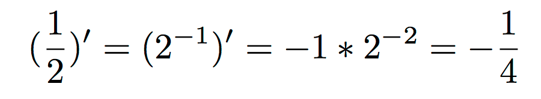
>Doing parallel programming is really easy, as long as you don't need it to run fast

---

#1. WHY GPGPU

---

GPU 

* What is a GPU ?
>A graphics processor unit (GPU), also occasionally called visual processor unit (VPU), is a specialized electronic circuit designed to rapidly manipulate and alter memory to accelerate the creation of images in a frame buffer intended for output to a display. GPUs are used in embedded systems, mobile phones, personal computers, workstations, and game consoles

---


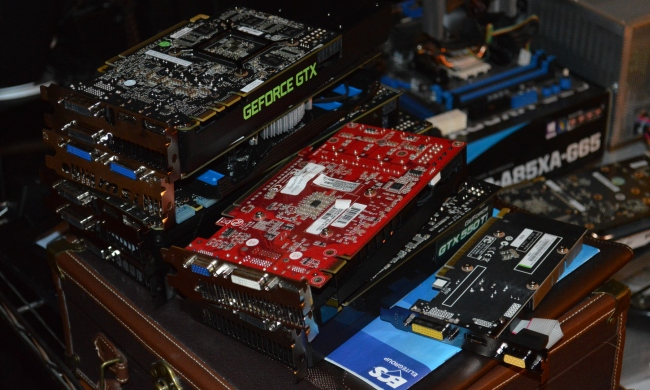

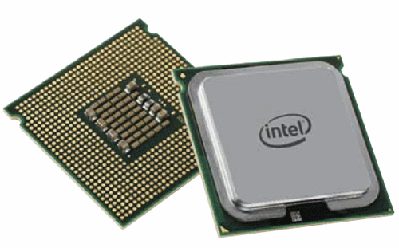

---

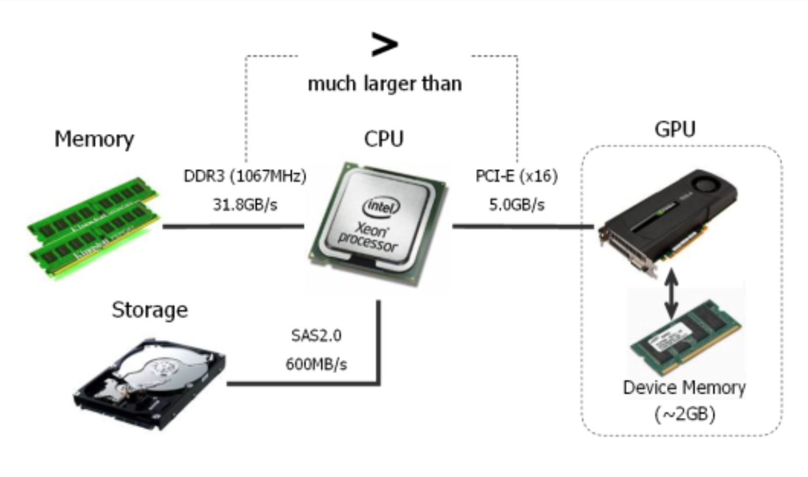

---

What is GPGPU ?
* Using GPUs for general purposing programming (history note)
* GPGPU get mainstream after 2008
* The idea is to use the GPU not only for graphics, but for general purpose computing

---

## Using GPUs for general purpose programing ?


---

* Moores law
* Wall
 * ILP
 * Memory
 * Power

---

Single core gets up to 15% faster per year

Multi core gets up to 75% faster per year

FMAD double = 50pj

Moving 64b 1mm = 25pj

--

i7 = 2000pj per instruction

Fermi = 200pj per instruction

---


---

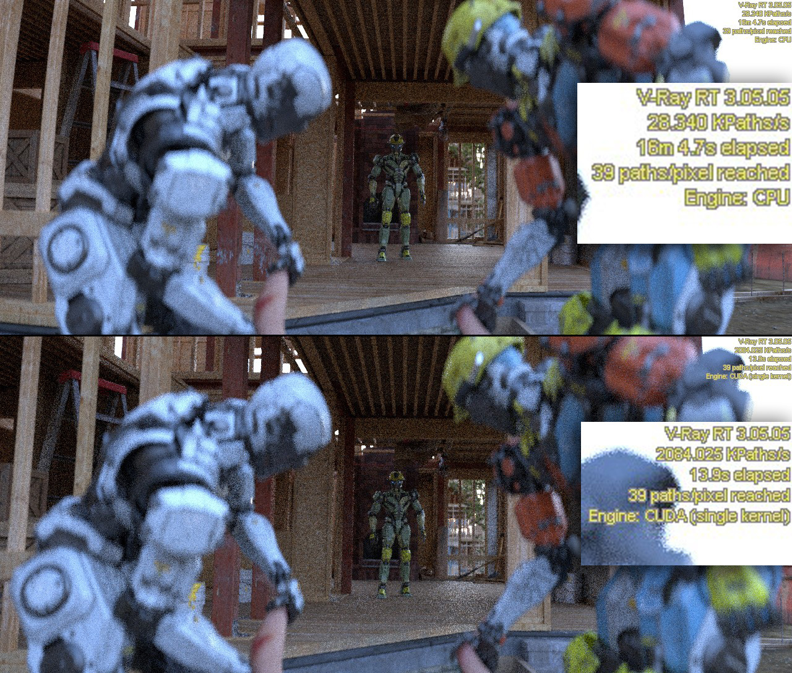

---

#Why the GPU runs so fast ?

---

* Latency
 * How fast a car can go on this road?

* Bandwitdh
 * How many cars can go on this road at the same time ?

* Throughput 
 * How many cars can go on this road for an hour ?

The GPUs are designed for throughput. What does this means and why this is the case ?

What is the CPU designed for ?

---

## Performance = Parallelism

## Efficiency = Locality

GPGPU is taking that into account

---

* The GPU is huge SIMD machine designed for embarrassingly parallel tasks (like CG)

Programming Model:
* Cache **hierarchy** (memory type is explicitly declared in code)
* Each SIMD lane is a different thread (some call it SIMT)
* Write the program as only one SIMD lane will execute it
* Run it on **thousands** of lanes(threads), each lane(thread) operating on different data
* Fundamental: synchronization on global level is **not possible** (but there are atomics)
 * So you **don't have to worry about synchronization**
 * But problems that require synchronization are harder (some impossible) to do

---

#2. APIs for GPGPU

---

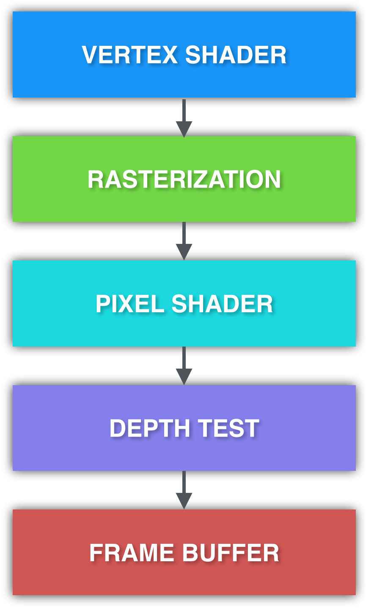

OpenGL, DirectX, Vulcan, Metal, Mantle, PlayStation

---

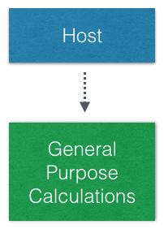

Shader units execution only

---

Each API has two parts - C/C++ API to send tasks & data to the device (1) and C-based language, used to write programs for the device (2)

1. OpenCL (Khronos) - **everywhere\***
2. Metal (Apple) - OS X & iOS
3. Direct Compute (Microsoft) - Windows
4. CUDA (nVidia) - nVidia
5. RenderScript (Google) - Android

In contrast, APIs for graphics* are OpenGL, DirectX, Metal, Vulcan

---


GPGPU API goals
* Use (all computational) resources in the system — CPUs, GPUs and others
* Based on C99
* Data- and task- parallel computational model
* Abstract the specifics of underlying hardware

---

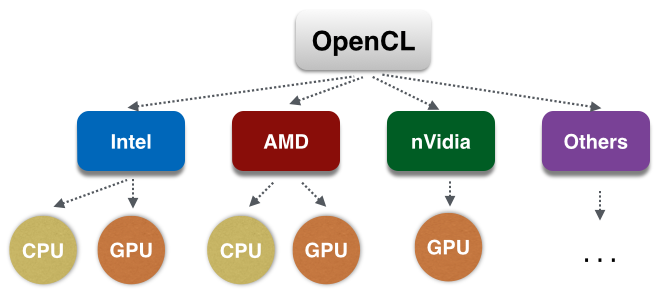

<a href="http://www.bing.com">bing</a> for **"{VENDOR} {CPU/GPU} OpenCL Runtime"**

---

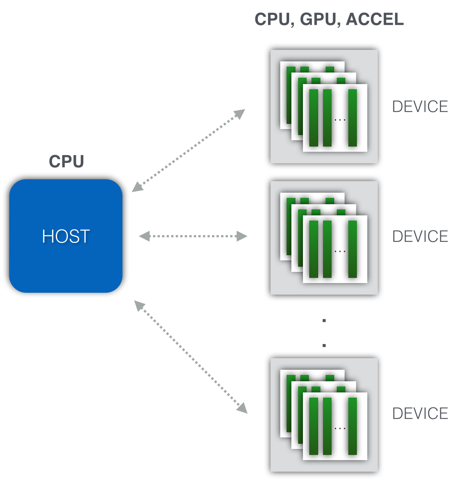

GPGPU APIs view of the system

-

Host (CPU) can send data to multiple devices (CPUs, GPUs, Accelerators)

-

Each device has piece of code compiled for each architecture, 
which the host can invoke.

---

## GPU Architectures:
1. Intel (desktop & mobile)
2. nVidia (desktop & mobile)
3. AMD (desktop & mobile)
4. ARM (mobile)
5. Imagination (mobile)
6. Qualcomm (mobile)
7. & Others

---

## Device Thread Model

* Have a parallel problem.
* Write a program as it will be executed on **one thread**.
 * Each thread gets **unique id** (using API call). 
 * Using that, each thread can fetch unique data to operate on (we don't want all the threads to calculate the same thing over and over again).

---

## Device Thread Model

* Threads are grouped into blocks (different are calling that differently).
 * In fact, this is due to the fact, that each "thread" is a SIMD lane. The size of the block thus is the size of the GPU SIMD unit. 4 to 32 in the hardware today.
* Threads within a block can communicate via shared memory (more on this later).
* This allows them to cooperate in tasks (for example, caching data that all of the thread in the block will need).

---


---

## Device Thread Model
* The SIMD unit has a fixed number of lanes. How many threads can we launch ?
 * Obviously **n * sizeof(SIMD width)**
  * What if we don't have such exact number of tasks to give ?
* How many threads to give to the GPU ?
* Designed to scale with hardware

---

#Hiding latency with multithreading

---

So far ...

ILP, cache, hyper threading, branch predictor, out of order execution, register renaming

---

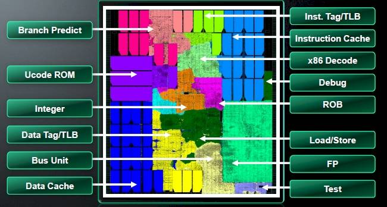

The GPU has totaly different approach !

---

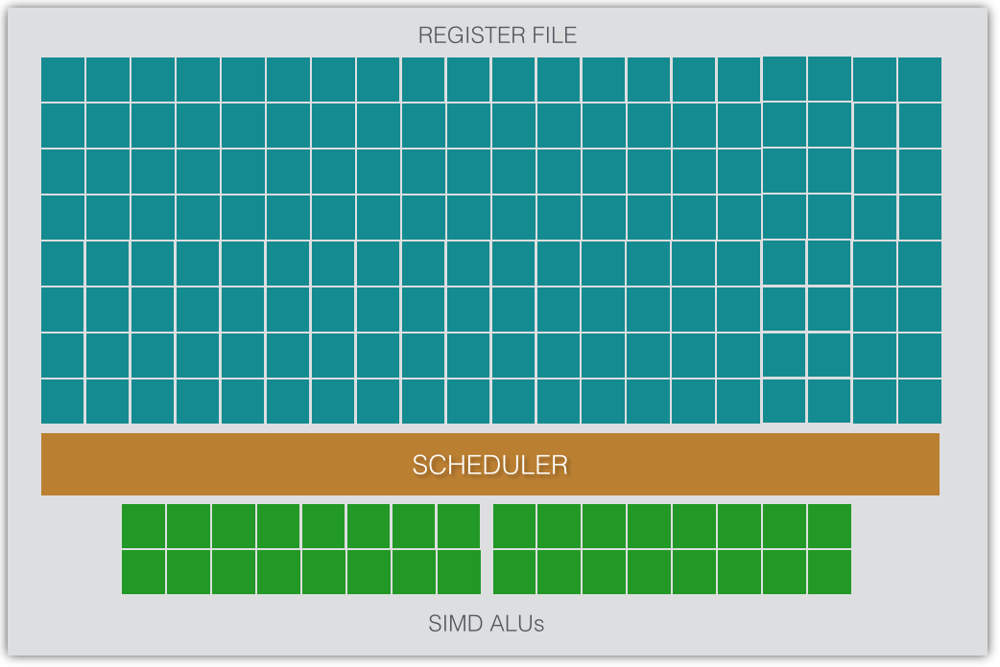

---

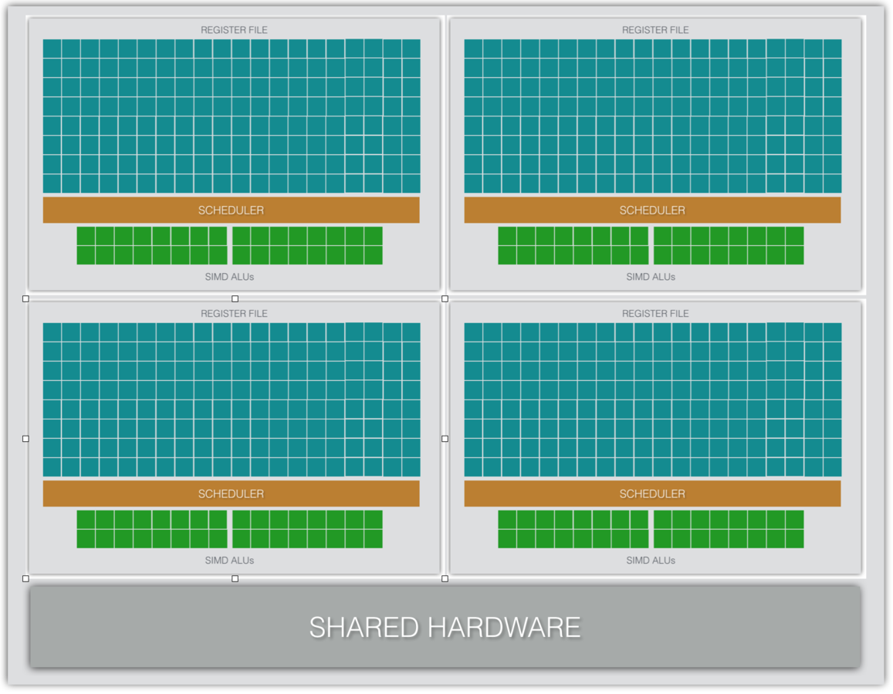

---

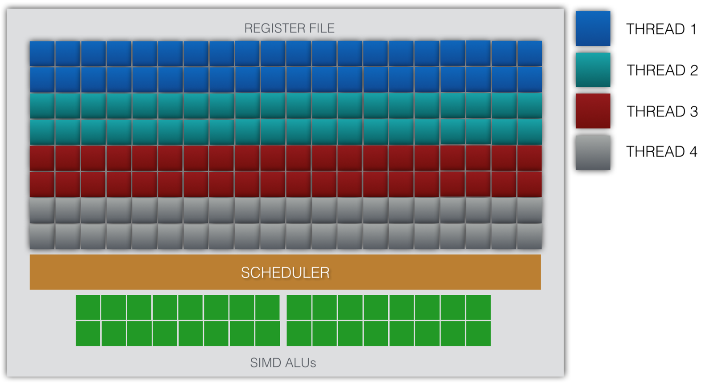

---


---

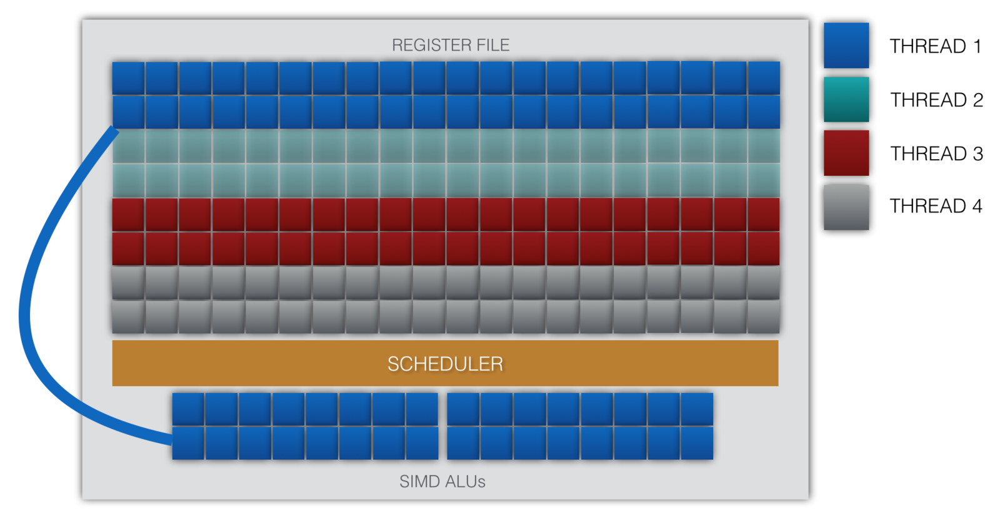

---

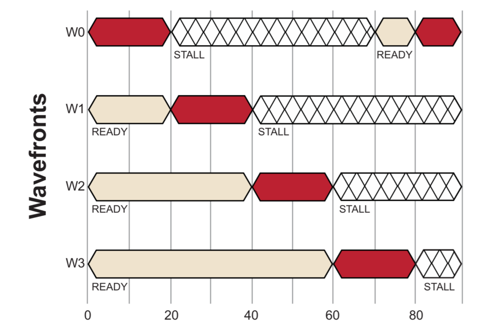

---

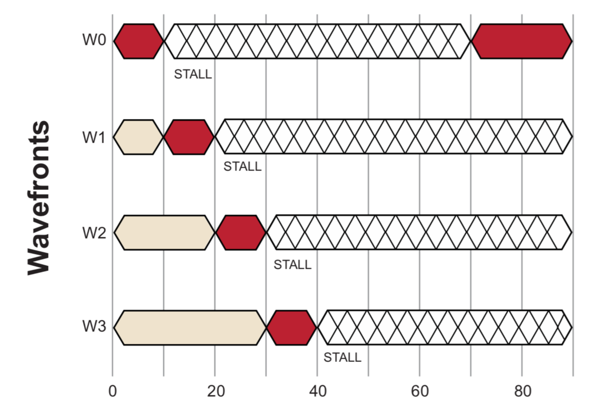

---

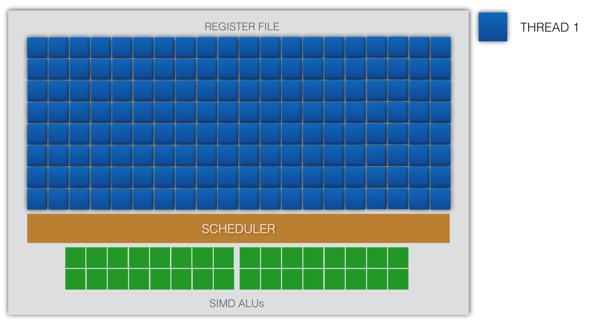


---

##solutions
* Prepare fewer threads (reduce occupancy or threads in flight)
* Register spill
* Function call
* Code generation

More on this later ...

---

##divergence

```__global__
void squareEvenOdd(int* a, int count) {
    int id = globalThreadIdx();
    if (id >= count)
        return;
    if (id % 2)
        a[id] = a[id] * a[id];
    else 
        a[id] = 0;
}
```

---

* You don't have to worry about correctness
* You have to worry about performance
```
if (globalID() % 2 == 0)
    //...
else
    //...
```
```
if (globalID() < totalTasks/2)
    //...
else
    //...
```

---

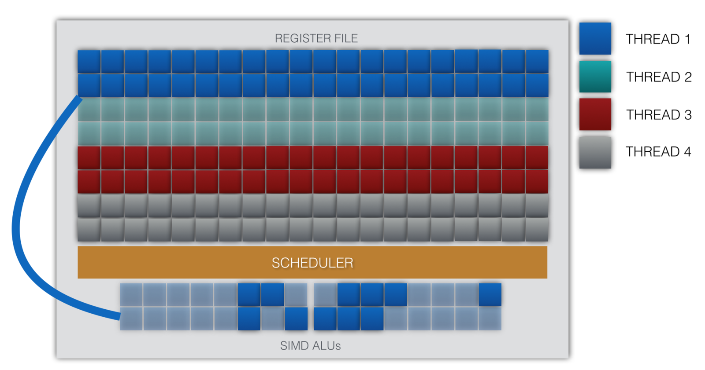

---

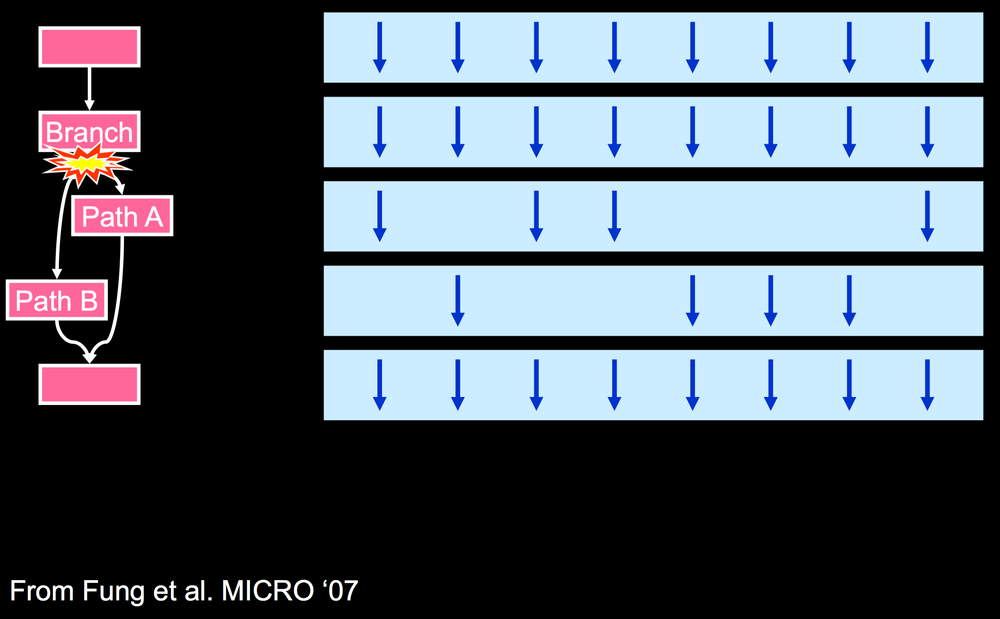

---

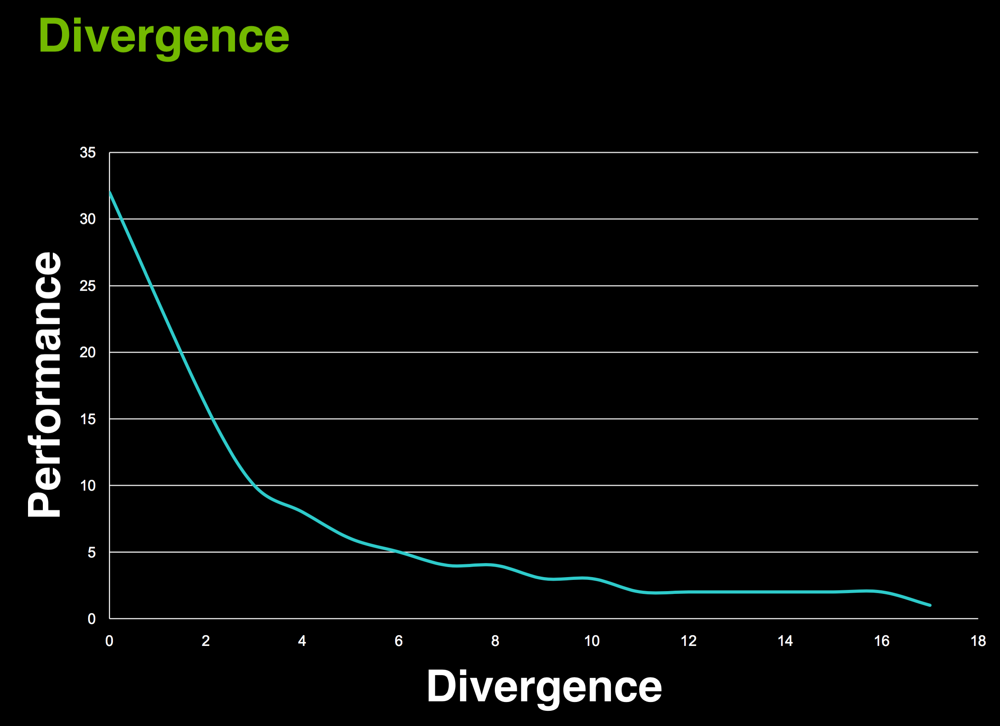

---


##solutions
* Ignore
* Multi kernel
 * Do 1st half of the work on the GPU
 * Sort the tasks on the GPU
 * Do the 2nd half of the work on the GPU

---


---

## IT IS LIKE HYPERTHREADING ON STEROIDS

#### optimized for throughput, not latency

---

Okay, but how does this looks in code ?

C++
```
void sum(float* a, float* b, float* res, int count) { 
    for (auto i = 0; i < count; ++i)
        res[i] = a[i] + b[i]
}
```
```
sum(a, b, res);
```

GPGPU
```
kernel void sum(float* a, float* b, float* res, int count) {
    int i = get_global_id(0);
    if (i > count) return;
    res[i] = a[i] + b[i];
}
```
```
device.transfer(a);
device.transfer(b);
device.transfer(res);
device.execture("sum");
device.getResult(res);
```

---

Difference between the CPU and the GPU thread models 

| CPU        | GPU           |
| ------------- |:-------------:| 
| Threads are expensive, no sense to have more threads than cores | Threads are cheap, make millions | 
| Context switch is expensive     | Cheap and happens every cycles      | 
| Branch can be expensive, but most of the time is cheap | Most often, branches are really expensive  | 
| Writing a lot code does not hurt the perfromance | Writing a lot code **might** hurt the perfromance |

---

**Millions** of threads are send to the driver 

**Tens of thousands** of threads are prepared on the GPU for execution

**Thousands** of threads are running at the same time


<!--- 22.XII.2015 lecture starts here --->

---

AMD Boltzmann initiative - CUDA running on AMD

---

# Memory model

---

Device and host are having physically different memories

You have to copy that back on forth (memcpy-like)*

---

* Device memory
 * Registers X1
 * Shared X5
 * Global X100
 * Constant - broadcast
 * Caches (L1, L2, NC, other)

* Host memory

---

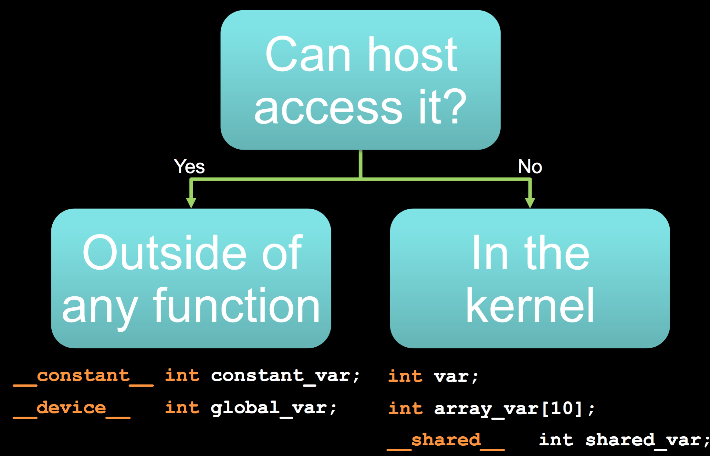

---

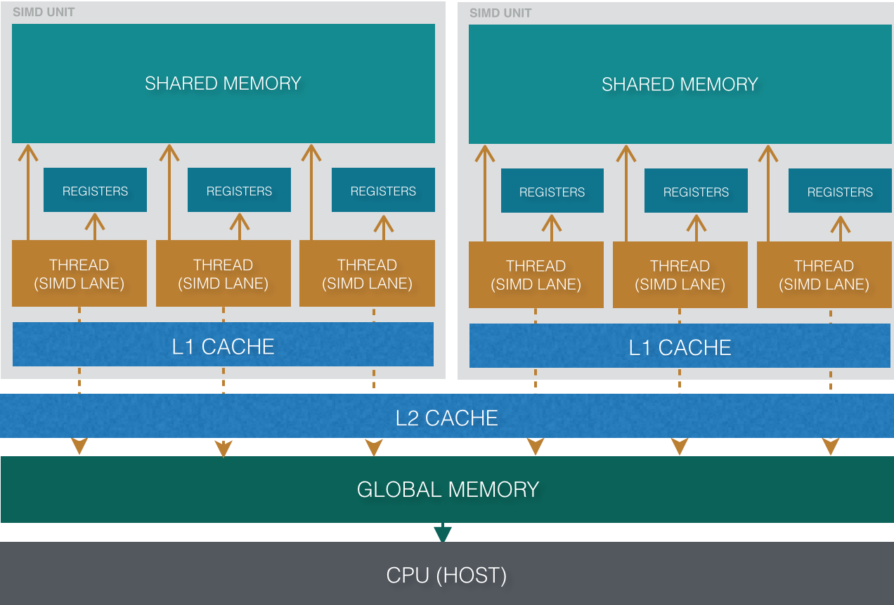

---

### Registers

```
int foo;
float bar[196];
Widget widget
void bar(float fizzBuzz) { // <-

}
```

* Every thread has **own view**.
* Possibly the most valuable resource you have.

---

What if your program needs more register than the hardware has ?
* By default, the compiler will try to spill as less as it can
 * Thus, reducing occupancy
* Registers are spilled in the global memory. Which register is spilled is unknown for the programmer.
* The part of global memory used for spill is called **local memory** in CUDA. **local memory** in OpenCL means **shared memory**. Confussion is going to happen.

---


---

How we will cal them: 
* **Private** or **Register** - when the memory is private and in register
* **Private** or **Spilled** - when the memory is private and in global
* **Shared** - when the memory is shared 
* **Global** - when the memory is global
* **Constant** - when the memory is constant

---


### Global 

```
__global__ int* ptr;
float bar[196]; //! <-
Widget widget;
```

* The threads has the **same view** of the global memory.
* Most of the GPGPU apps are strugling with the global memory.
* What can be done ?
* Is HBM going to help ?

---

### Constant 

```
__constant__ int c[42];
```

* CUDA
* OpenCL 1.X
* OpenCL 2.X
* Shared view or own view here ?

---

### Shared 

```
__shared__ int something[42];
```

* Block of threads has same view.
* Different block has different view.
* Most of the GPGPU apps are optimizing by finding a way to exploit the shared memory.
* The idea is to cache manually what is needed in the shared memory and use the shared memory instead of the global memory.

---

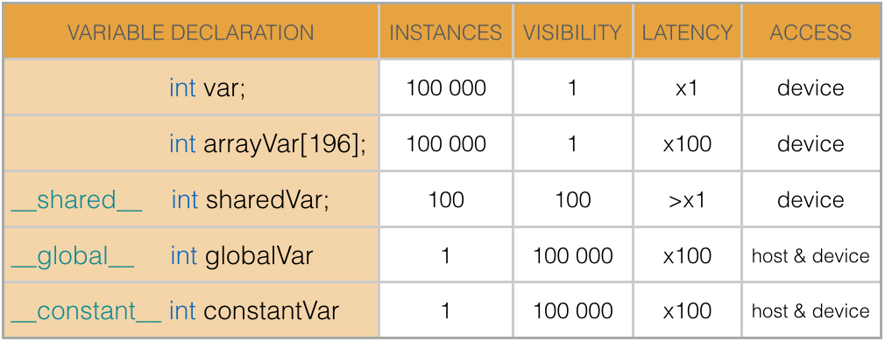

---

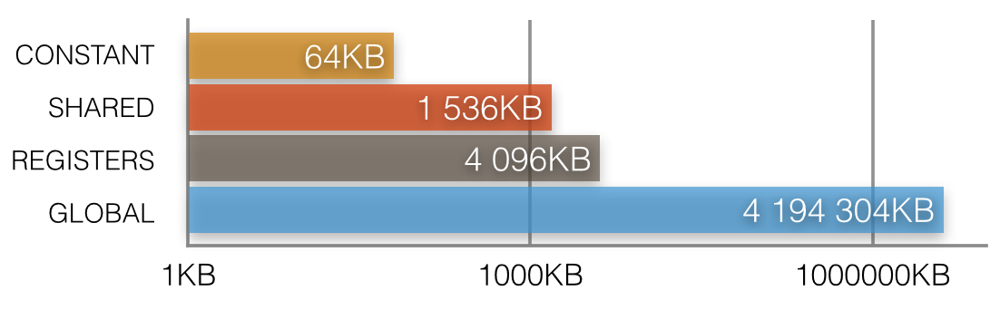

---

You can't **new** and **malloc** in device code.

Why ?


What about virtual functions ?imag

---

Okay, but how does this looks in code 

```
float data[DATA_SIZE];
for(int i = 0; i < DATA_SIZE; i++)
    data[i] = rand() / (float)RAND_MAX;
//
cl_mem input = clCreateBuffer(context,  CL_MEM_READ_ONLY,  
                sizeof(float) * DATA_SIZE, NULL, &err);
clEnqueueWriteBuffer(commands, input, CL_TRUE, 0, 
                sizeof(float) * DATA_SIZE, data, 0, NULL, NULL);  
//
clEnqueueReadBuffer(commands, output, CL_TRUE, 0, 
                sizeof(float) * DATA_SIZE, data, 0, NULL, NULL);

```

More code in the next lecture.

---

Exam:

30.01.2016 - 101 - 09:00 - 11:00

13.02.2016 - 101 - 09:00 - 11:00

Projects:

13.02.2016 - 101 - 11:00 - 14:00

---

Not a single well-done solution :(

0. Pre-compute everything possible
1. Update acceleration based on gravity
2. Update acceleration based on fuel and engines and delta
3. Update position and velocity based on acceleration and delta
4. Detect crashes and kills
5. Remove dead bodies

---

* You can use pointers, of course.
* Prefer simple, regular acces patterns. 
* Avoid pointer chasing.
* Avoid mixing pointers from different memory types.

---

* Read-only memory -> constant ?
* Read-write & shared -> shared ?
* Read-write per thread -> private
* A lot of memory -> global

---

# Q&A
