>"If at first you don't succeed, try, try again." The Rescuers (1977)

Note:
code samples from cs-193-stanford

---

GPU:
* Can only access GPU memory
* No variable number of arguments
* No static variables
* Limited recursion
 * Better go without it
* Limited polymorphism
 * Better go without it

Function must be declared with qualifeier:
* __global__, __device__, (__host__)

---

* All APIs are context-dependend 
 * What is a context ?

```
cuMemAlloc(gpu_id0, ptr, numBytes);
cuMemAlloc(gpu_id0, ptr, numBytes);
```
vs
```
pushCtx(gpu_id0);
cuMemAlloc(ptr, numBytes);
cuMemAlloc(ptr, numBytes);
popCtx(gpu_id0);
```
Context are stored in a stack.

Suitable when doing funciton calls.

---

Usually, there is 1 context for each device.

Many times we need to feed the device from multiple threads. This is done through **streams**.

Usually, there is 1 **stream** for each host thread.

---

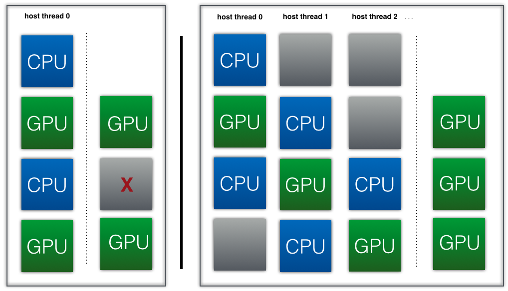

---

What the host does:

1. Call API::init().
2. Query for number of devices.
3. Get a handle to each device (get context for each device).
4. Push the context of **device i**.
5. Allocate / Transfer device memory. Call kernel. Wait until kernel end.
6. Pop context for **device i**. Push the context for **device i+1**.
7. Goto **4** if we have more devices, otherwise goto 8.
8. Free the resources allocated per device.
9. Call API::free().

---

CUDA compilation
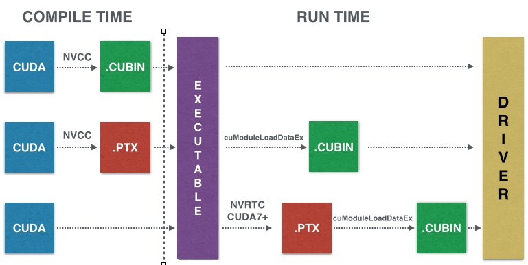

---

OpenCL compilation
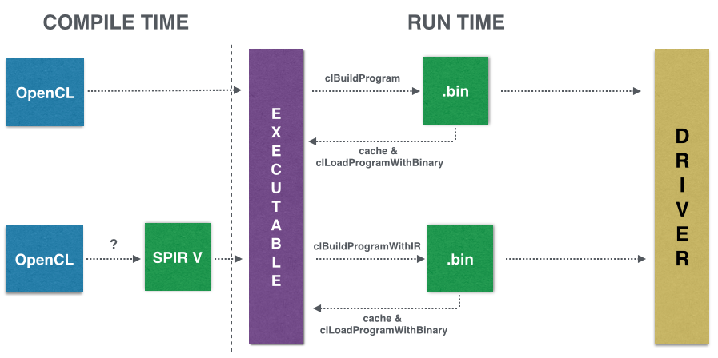

---


## [DEMO OpenCL Hello World]

<!--- First lecture 2016 begins here (5.I) --->

---

## [DEMO Thread Local & Global Index]

---

The execution on the device has **no order**.

If you need such, use atomics or multiple calls from the host.

---

## [DEMO Race condition]

---

## [DEMO Crashing kernels]

---

#TIPS

---

## Global memory

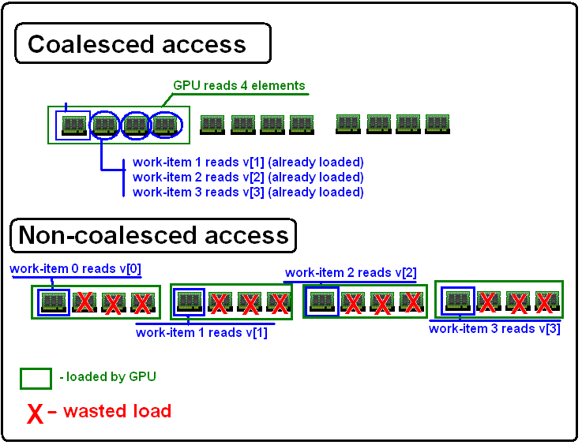

Proiflers can help.

---

Reads from same thread block are grouped.

Reads from same SMX are grouped.

Read from DRAM are grouped.

Exploit that.

---

Memory coalescing

SoA vs AoS

Most of the time spend optimizing is reducing the reads/write from/to memory

---

## Shared memory

* Shared memory is (sometimes) banked

* Each shared memory unit is implemented with multiple memory banks

* If 2 or > thread access different values rom the same bank, you get a conflict, meaning that the requests are serialized

* It is a limited resource, so it can limit the occupancy

---

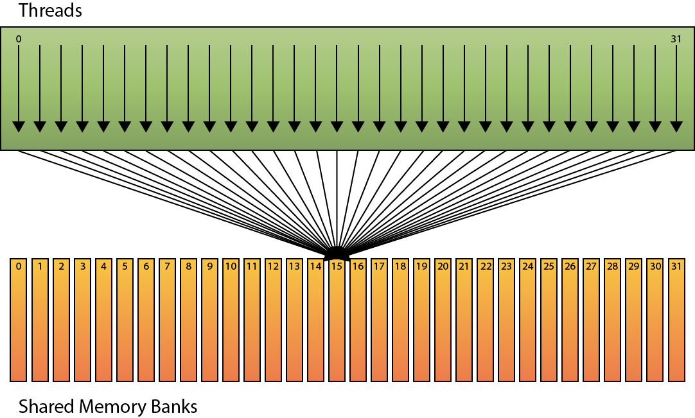

---

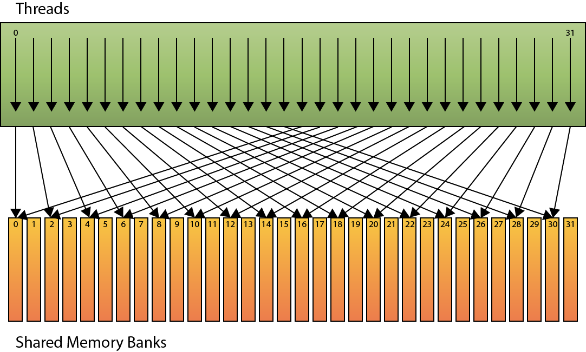

---

## [DEMO ADJ DIFF]

---

Fermi (2), Kepler (3), Maxwell (5)

CUDA SDK 4, 5, 6, 7

---

## [DEMO Matrix multiply]

---

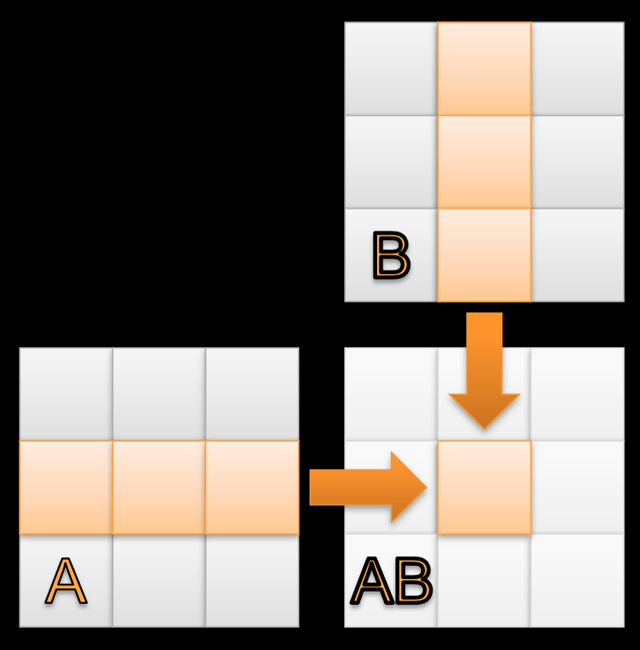

---

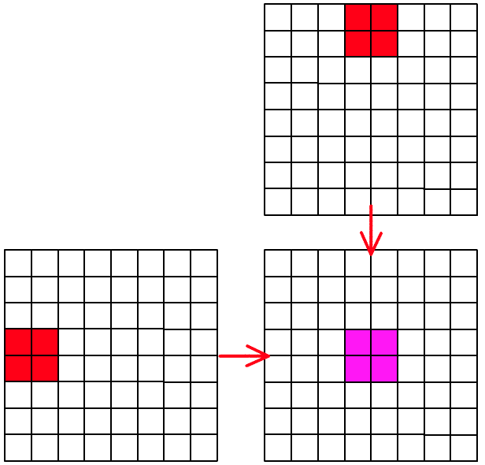

---

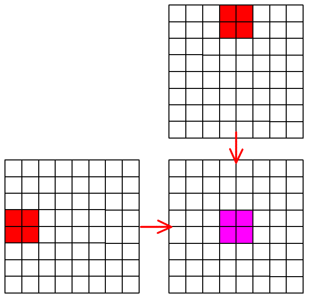

---

##[DEMO Matrix Multiply 2]

---

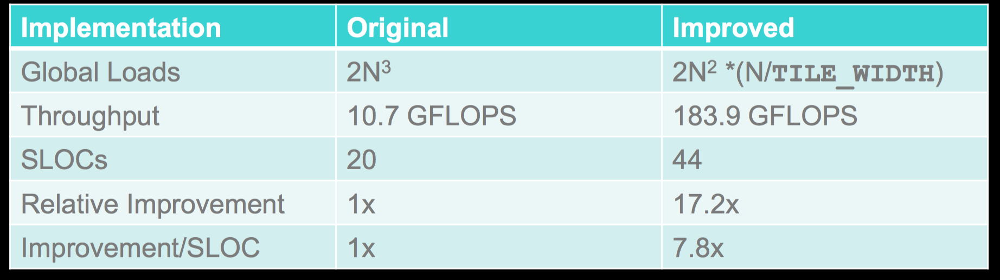

---

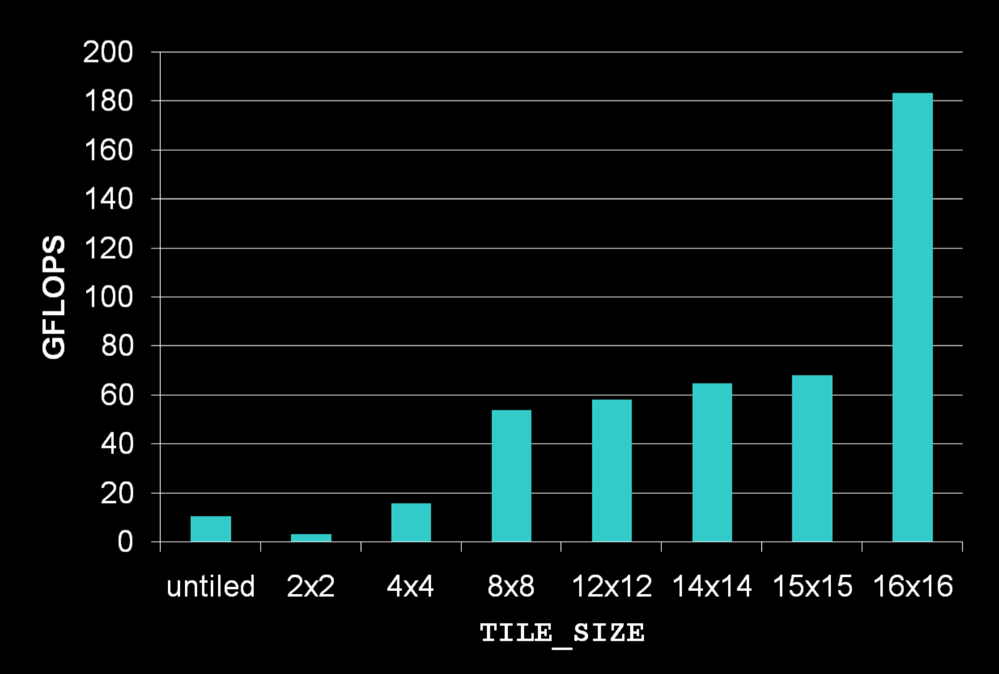

---

This pattern (partitioning the tasks into blocks) is a common pattern, used not only in the GPGPU programming.

---

#[DEMO NVCC and NVRTC]

* Loading CUDA program from CUBIN (nvcc)
* Loading CUDA program from PTX (nvcc)
* Loading CUDA program from CUDA SOURCE (nvrtc)

"nv" = nVidia, cc = "cuda compiler", "rtc" = "runtime compiler"

---

## Registers

* It is a limited resource, so it can limit the occupancy

* Monitor the register usage

* Create function calls to reduce the register pressure
 * The programming guides claim that this makes no sense, but it does
 * `__noinline__ in CUDA`, `attribute((noinline))` in AMD OpenCL (driver 15.7+)

---

Reduce the number of parameters, that the kernels have


```
while (hasWorkToDo) {
    launchKernel(kernel, param0,
                param1, param2, ... , paramN);
}
```

```
launchKernel(setParamsKernel, param
            param1, param2, ... , paramN,
            paramsHolder);
while (hasWorkToDo) {
    launchKernel(kernel, paramsHolder);
}
```

---

The GPGPU implementations are trying to spill as little registers as possible
 This is usually a good thing.

For bigger kernels however, the occupancy can be hurt really bad.

Some GPGPU APIs are allowing to limit the register usage per thread (--maxregcount).

Test.

---

You have so many raw flops power, that almost all of the time you are memory bound

Random reads from **global memory** are very slow.

Random reads from **constant memory** are even slower (!).

Re-calculating sometimes is better than caching.

---

It is possible however, to achieve better performance with lower occupancy.

>"Better Performance at Lower Occupancy", Volkov, GTC 2010

The idea is to reduce the occupancy in order to have less spills.

You can compensate that with ILP. Works in some situations.

You can reduce the occupancy by allocating more shared memory, for example.

---

>Maxwell combines the functionality of the L1 and texture caches into a single unit. As with Kepler, global loads in Maxwell are cached in L2 only, unless using the LDG read-only data cache mechanism introduced in Kepler.

---

Intrinsics:
```
#if (__CUDA_ARCH__ >= 350)
    #define LDG(X) __ldg(&(X))
#else
    #define LDG(X) (X)
#endif //(__CUDA_ARCH__ >= 350)
int x = LDG(data);
```
Textures:
```
int x = tex1D<int>(texture0, offset);
Inline PTX:
```
PTX instruction 
```
ld.global.nc
```

nvcc:
```
#define CONST(T) const T* restrict 
CONST(int) x = ...
```

* If we have time - loadAs(...)

---

Other intrinsics.

sin -> 100, cos -> 100, sincos -> 150

```
void __sincosf(float x, float* sptr, float* cptr)
float x = sin(f);
float y = sin(f);
```

```
float __saturatef(float x);
float x = max(0.f, min(x, 1.f));
```
`--use-fast-math`

+other

---

The block runs with the speed of the slowest thread in it.
```
for (int i = 0; i < localIndex; ++i) {
    for (int j = 0; j < localIndex; ++j) {
        doComplexWork(j);
    }
}

```

---

CUDA occupancy calculator

Registers using -xptxas -v

---

function inlining

__noinline__

multi kernel

---

# Faster host-device transfers

---

Pinned memory

```
CUresult err = cuMemHostAlloc( &buf, size, 0);
```

```
clCreateBuffer(clContext, CL_MEM_WRITE_ONLY | CL_MEM_ALLOC_HOST_PTR, size, NULL, &err);
```

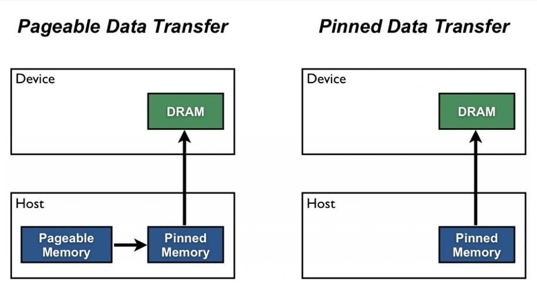

---

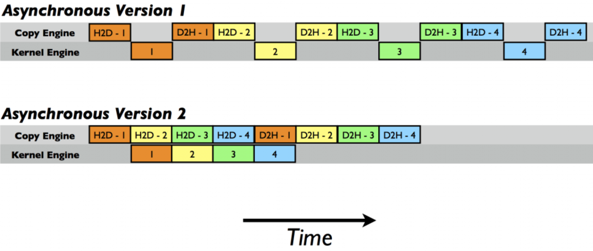

If you fail to this correctly, it will fallback to sync copies (which su_).

It is a bit tricky (and considered advanced).

---

AMD APUs

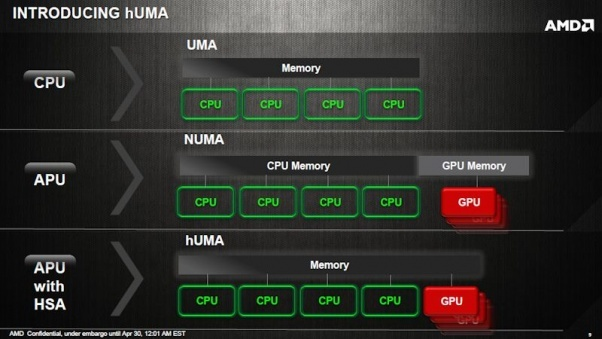

---

nVidia NVLink

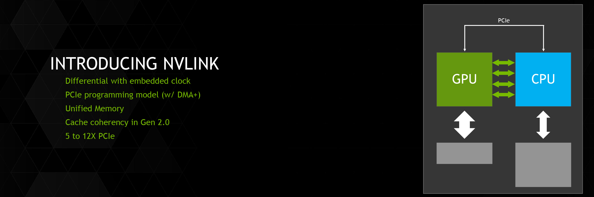

---

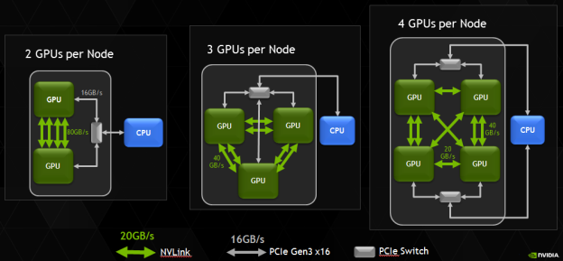

* Power CPUs only at the moment
 * X86 most likely will never happen
 * ARM ?

* Promissing for GPU-to-GPU data access

How is it implemented ?

---

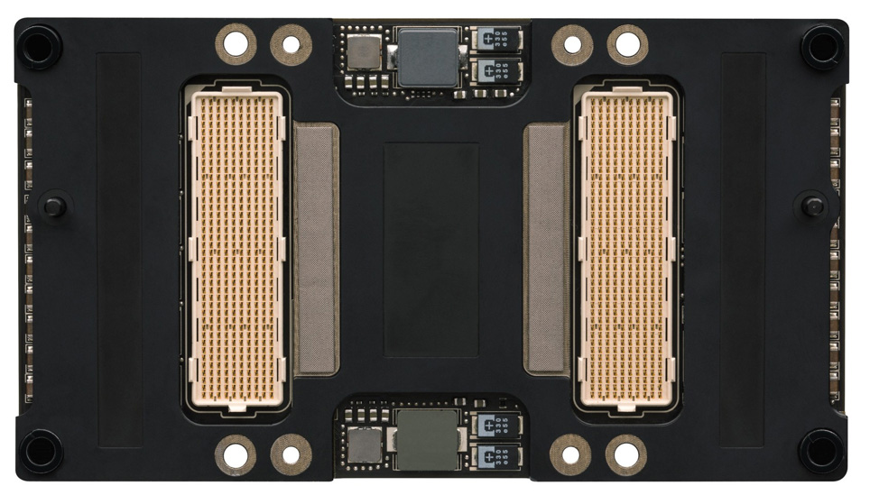

mezzanine connector

---

## GPU Programming patterns

* Reduction

* Partition / Split

* Expand

---

# Reduction


```
//serial
float sum(float* data, int n) {
    float res = 0.f;
    for (int i = 0; i < n; ++i) result += data[i];
    return result;
}
```

---

12.I.2016 lecture starts here

---

Recap

CUDA runtime API, CUDA driver API

Banked (shared) memory

LDG intrinsic, blocked matrix multiply

Reduction (we will check that again)

---

## [DEMO SUM] (using atomic & using shared memory)

Tree-approach

Kepler & Fermi are using software-atomic-adds in shared memory

Maxwell is using hardware-atomic-adds in shared memory

---

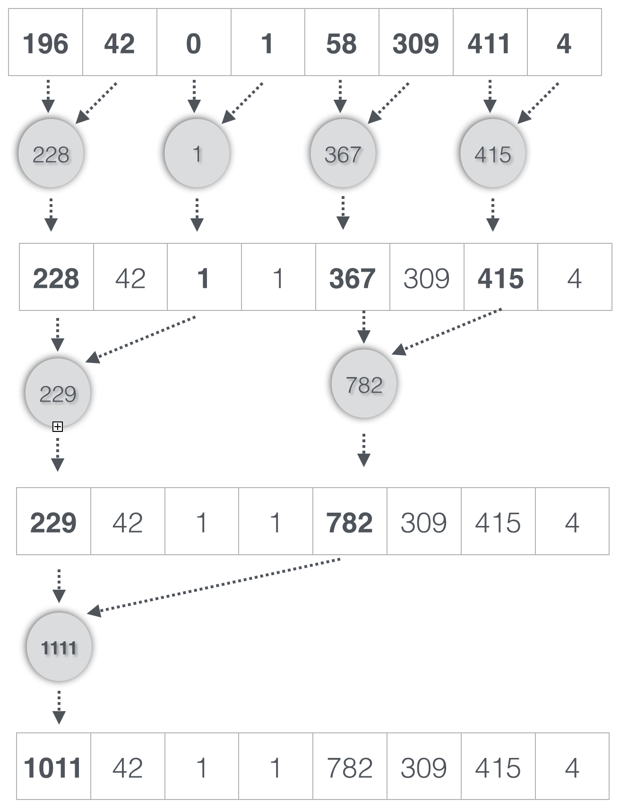

---

## [DEMO Block Sum]

`O(n)` - serial

`O(n/p + logn)` - (p)arallel

---

Problem:

Variable number of elements per thread ?

-> parial sum (scan)


---

| 3 | 1 | 7 | 0 | 4 | 1 | 6 | 3 

| 0 | 3 | 4 | 11| 11| 15| 16| 22

---

## [DEMO Inclusive Scan]

---

* Sort
 * Counting sort - how do we do it ?
 * Odd-Even sort

---

#Q&A

---

Note:
Bonus slides in case we have time

---

Dynamic parallelism

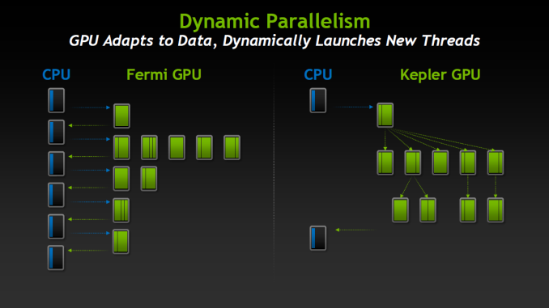

OpenCL 2.0 enabled devices

CUDA 3.5 or newer

---

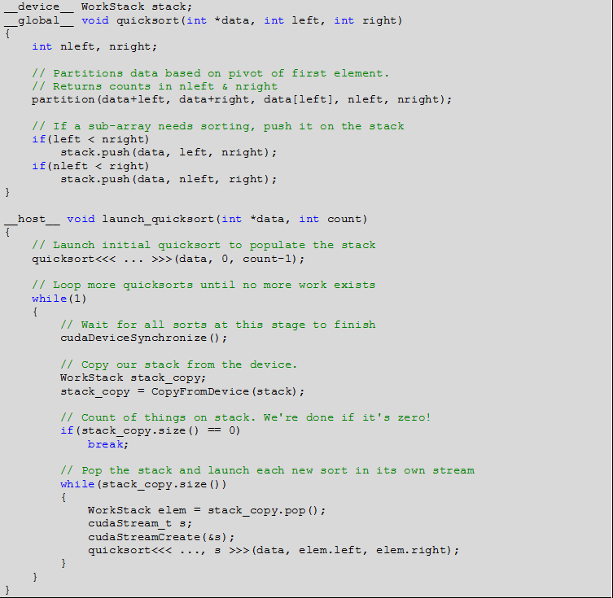

---

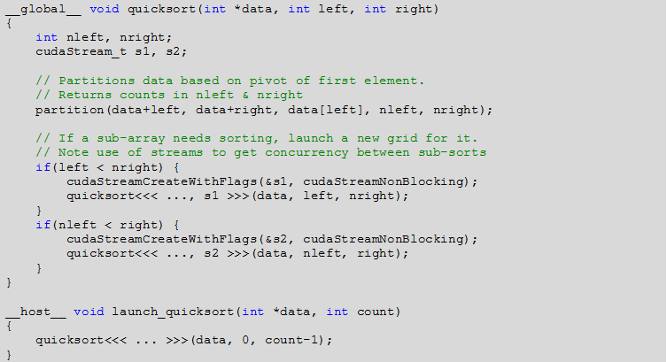

---

With OpenCL 2.X

* Dynamic Parallelism

* Pipes

* Shared Virtual Memory

* Recursion, C++, ...

---


#CUDA THRUST

```
#include <thrust/host_vector.h>
#include <thrust/device_vector.h>
#include <iostream>
int main(void) { 
    // H has storage for 4 integers 
    thrust::host_vector<int> H(4); // initialize individual elements 
    H[0] = 14; H[1] = 20; H[2] = 38; H[3] = 46;
    // H.size() returns the size of vector H
    std::cout << "H has size " << H.size() << std::endl;// print contents of H
    for(int i = 0; i < H.size(); i++) 
        std::cout << "H[" << i << "] = " << H[i] << std::endl;
    H.resize(2); 
    std::cout << "H now has size " << H.size() << std::endl; 
    // Copy host_vector H to device_vector D
    thrust::device_vector<int> D = H;
    D[0] = 99; D[1] = 88;
    // print contents of D 
    for(int i = 0; i < D.size(); i++)
        std::cout << "D[" << i << "] = " << D[i] << std::endl; // H and D are automatically deleted when the function returns return 0; }
}
```

---

Thrust

```
#include <thrust/sort.h> 
#include <thrust/functional.h>
//...
const int N = 6;
int A[N] = {1, 4, 2, 8, 5, 7};
thrust::stable_sort(A, A + N, thrust::greater<int>()); // A is now {8, 7, 5, 4, 2, 1}
```

Pros: has CPU fallback. Header only.

Cons : CUDA only, needs nvcc to compile.

---

Other:
* OpenCV, clSPARSE, cl******
* Video Decoders
* cuBLAS, cuSPARSE, cuFFT, cuSPARSE, OptiX
* ArrayFire

---

#Case study - mini GPU raytracer

---


---

If you want to know more on the topic - "3D графика и трасиране на лъчи", Веселин Георгиев, ФМИ

---


---

Do we have embarrassingly parallel problem ?

What are the tasks that we should give to the GPU ?

What are the potentials problems that we should be aware ?

How are we going to implement a random generator ?

---

[DEMO Case study - GPU raytracer]
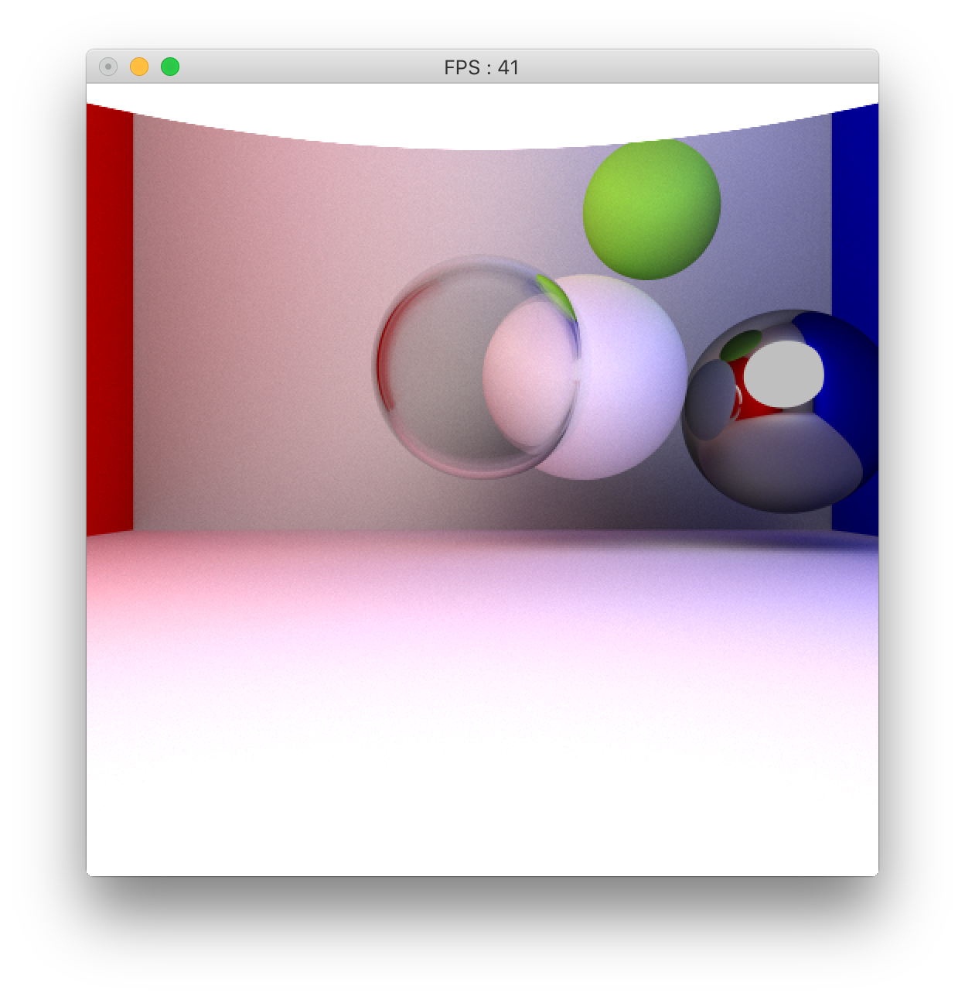

---

Instead of transfering data back to the CPU and send it again to the GPU to show it on the display, we can do **interop**.

It is like the CUDA program is writing the result directly in the buffer that is shown on the display.

Thus, we spare some transfers.

---

The flow is as follows:

1. Init CUDA & OpenGL APIs.
2. Send some seeds for the random generator for each ray on the GPU.
3. Call the "raytrace" kernel. It will trace a ray and store the result in the OpenGL texture. The scene is hard-coded in the GPU source.
4. Repeat forever.

In case of user input, update the camera position and transfer the new one to the GPU.

It is easier than it sounds. 

[source code examination]

---

# [DEMO nSight profiling]

---

* nSight (-lineinfo)
* Shared mem
* Fast Math
* maxregcount

---

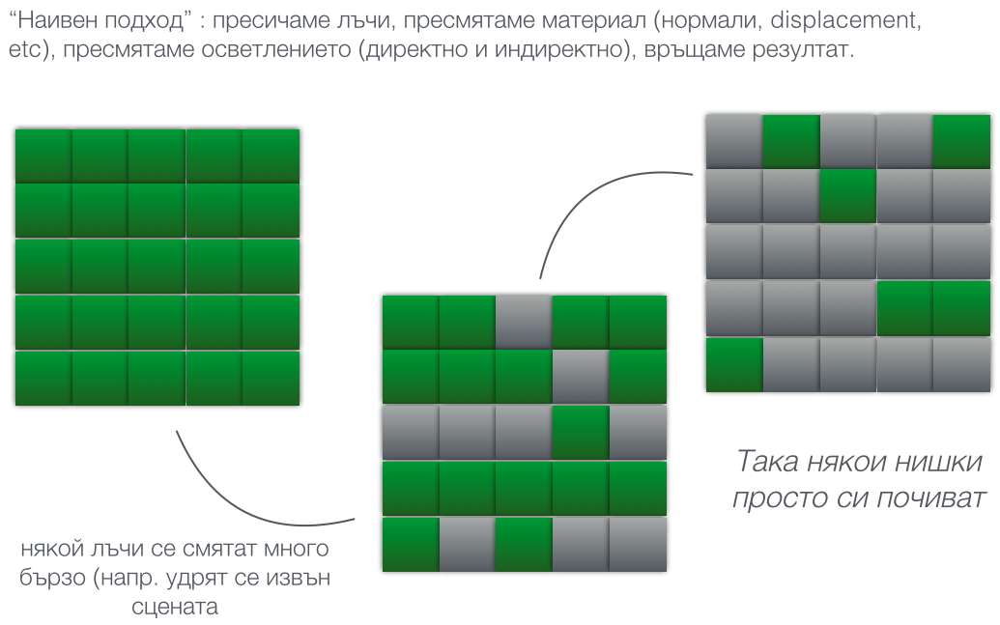

---

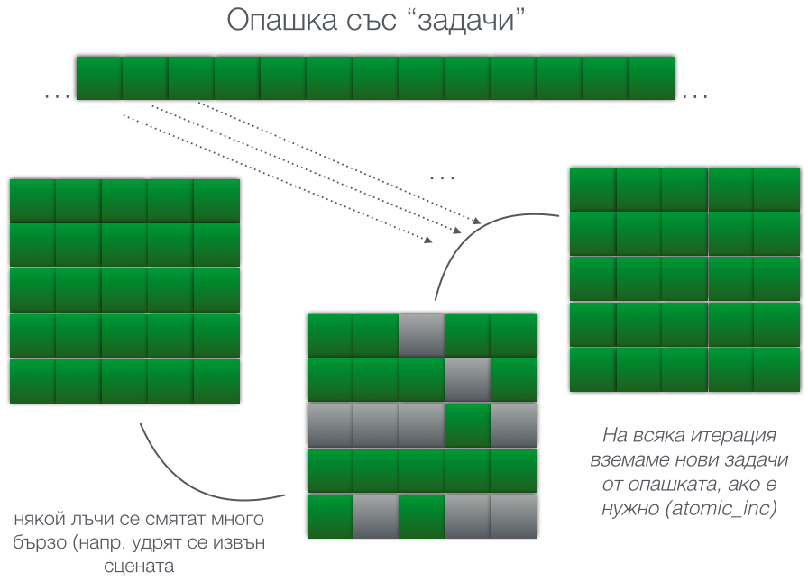

---


