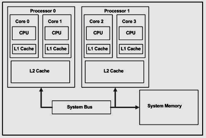
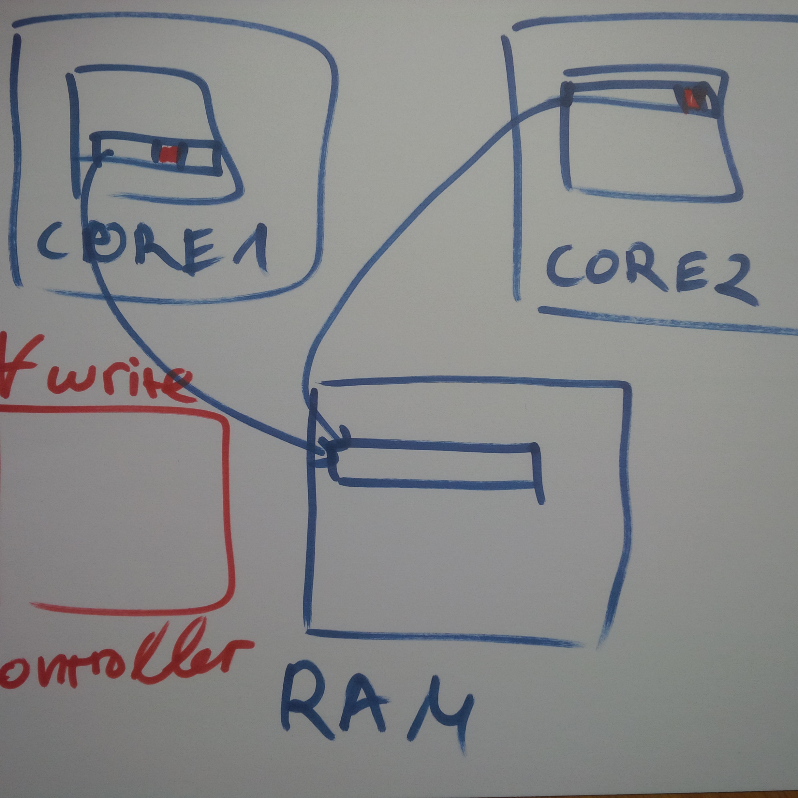
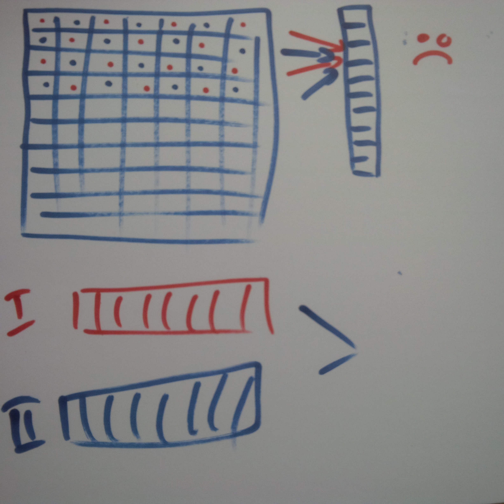

---

Multithreading
==============

Contents
--------

-	Theory
-	Hardware
-	OS
-	Practice

---

Instruction Level parallelism is difficult, because of the dependencies between instructions. But from 100 meters away, there might be some independent instructions to execute.

---

Thread Level Parallelism (TLP)
------------------------------

A program may have different threads of parallelism.

-	game - rendering, gameplay, physics, ...
-	simulation - each actor
-	server with multiple clients

---

-	(Currently) Requires programmers to think!

---

Theory
------

> Multiprocessing is the use of two or more central processing units (CPUs) within a single computer system. The term also refers to the ability of a system to support more than one processor and/or the ability to allocate tasks between them.

---

### Amdahl's law

> The speedup of a program using multiple processors in parallel computing is limited by the time needed for the sequential fraction of the program.

---

-	*n* - number of threads
-	*B* - fraction of the program that is strictly serial
-	*T(n)* - time for executing using *n* threads

---


-	*S(n)* - speedup for executing using *n* threads


---


---

### Gustafson's law

Parallel Program Execution Time = <font color="red">`a + b`</font>

* <font color="red">`a`</font> = serial time
* <font color="red">`b`</font> = parallel time on any of the `P` processors

* <font color="red">`P`</font> = number of processors;

---

Sequential Program Execution Time = <font color="red">`a + P*b`</font>

=> speedup = `(a + P*b) / (a + b)`

---

\#define <font color="red">`α`</font> (serial part) = <font color="red">a / (a+b)</font>`

to be the sequential part of the parallel execution

=> `a+b = α + P * (1 - α) = ` <strong><font color="red"> `P - α * (P - 1)`</font></strong>

---


---

>Thus, if α is small, the speedup is approximately P, as desired. It may even be the case that α diminishes as P (together with the problem size) increases; if that holds true, then S approaches P monotonically with the growth of P.

---

### Embarrassingly parallel

> Embarrassingly parallel problem, is one for which little or no effort is required to separate the problem into a number of parallel tasks.

---

Examples:

-	brute-force searches / algorithms
-	genetic algorithms
-	web server serving *static* content

---

-	*B* is almost 0
-	So *S(n)* is almost *n*

---

Can we get speedup more than *n*?

---

Yes, we can - think *caches*!

---

Hardware
--------

### Multi-CPU vs Multi-core

-	Multi-CPU - having more than one CPU
-	Multi-core - having a single CPU with more than one processing units

---

-	Multi-CPU is more complicated to implement
	-	all CPUs need to access the memory
	-	communication between CPUs
-	Current CPUs are multi-core
-	Supercomputers are Multi-CPU, Multi-\*

---


---

-	Cores share L3 cache
-	Cores (can) have private L1 and L2 caches
-	Cores share all the other parts of the CPU

---



http://www.drdobbs.com/parallel/effective-use-of-the-shared-cache-in-mul/196902836

---

-	Level 2 Cache is shared between a couple of cores

---

### Universe consistency

-	Sharing memory between multiple cores requires a model how this memory is used
-	Having private caches requires cache coherency

---

#### Cache coherency

http://www.cs.cmu.edu/afs/cs/academic/class/15418-s12/www/lectures/10_coherence.pdf

---

#### Memory model

---

For our purposes - achieving cache coherency and implementing the memory model is **NOT** trivial.

It makes our program **slow**.

---

### Why?



---

### global vs local accumulator



---

### Simultaneous Multi-threading (SMT)

-	aka Hyperthreading
-	each core has *k* sets of registers and control units
-	different "thread" can use different functional units
	-	thread 1 does floating point calculations
	-	thread 2 does integer computations
	-	...

### Non-uniform memory access

-	each processor has different access time to the addresses in memory

---

### Uniform memory access

-	all processor have the same access time to each address in memory

---

### Resources

-	https://www.cs.cmu.edu/~fp/courses/15213-s07/lectures/27-multicore.pdf

---

# What is a thread?

- registers + stack
- the heap is shared with all other threads

---

# How the OS schedules a thread

Operating systems switch between running every process (and every thread) on the
system hundreds of times in a second.
 
---

This switch happens at certain moments, typically when a thread is blocked in a
kernel call.

---

### Kernel vs User-Mode

- User-mode - your code
- Kernel code - the operating system kernel
  - file operations
  - allocations
  - network
  - mutex, semaphore

---


### Context switching

It is expensive.

- L3 cache miss < 100ns
- Context switch ~ 1300ns - without cache invalidation


http://blog.tsunanet.net/2010/11/how-long-does-it-take-to-make-context.html

---

### Points

- Do keep context switches to a minimum
- Do not update shared state

---

### False sharing

Two threads updating memory that is close (single cache line)

---

### Allocators in a multithreaded word

- They are important - each new/delete has a lock
- can help for *false sharing*

---

### Practice and terms

--

- Mutex
  - deadlock
- Critical Sections
- Conditional variables
- read / write locks

---


#### Atomic operations

- fetch_and_store
- fetch_and_add
- compare_and_swap

---

Lock-free data structures

---

*Atomic operations* are great, but:

- they are even harder to use correctly
- still quite expensive

---

### Pitfalls

- contention
- shared_ptr

---

### User and system mode - fibers

---

Practice
--------

-	Parallel programs

---

Thread Safe Stack

---

```
#include <exception>
struct empty_stack: std::exception
{
    const char* what() const throw();
};

template<typename T>
class threadsafe_stack
{
private:
    std::stack<T> data;
    mutable std::mutex m;
public:

```

---

```
    threadsafe_stack(){}
    threadsafe_stack(const threadsafe_stack& other)
        {
            std::lock_guard<std::mutex> lock(other.m);
            data=other.data;
        }

    threadsafe_stack& operator=(const threadsafe_stack&) = delete;
    void push(T new_value)
    {
        std::lock_guard<std::mutex> lock(m);
        data.push(std::move(new_value));
    }
    std::shared_ptr<T> pop()
    {

        std::lock_guard<std::mutex> lock(m);
        if(data.empty()) throw empty_stack();
        std::shared_ptr<T> const res(
        std::make_shared<T>(std::move(data.top())));
        data.pop();
        return res; 
    }
```

---

```
    void pop(T& value)
    {

        std::lock_guard<std::mutex> lock(m);
        if(data.empty()) throw empty_stack();
        value=std::move(data.top());
        data.pop();
    }
    
    bool empty() const
    {
        std::lock_guard<std::mutex> lock(m);
        return data.empty();
    }
};
```

---

-	patterns - singleton

C++11 ? Before C++11 ?

---

## Lock Free Stack

---

Lock free is hard to do, better copy/paste it ...

---

No joke. Thread safe is hard, lock free is harderererer.

---

```
template<typename T>
class lock_free_stack
{
    private:
    struct node {
        std::shared_ptr<T> data;
        std::shared_ptr<node> next;
        node(T const& data_):
        data(std::make_shared<T>(data_))
    {} 
    };
```

---

```
std::shared_ptr<node> head;
    public:
    void push(T const& data)
    {
        std::shared_ptr<node> const new_node=std::make_shared<node>(data);
        new_node->next=head.load();
        while(!std::atomic_compare_exchange_weak(&head,
           `                                     &new_node->next,new_node));
    }

std::shared_ptr<T> pop()
    {   
        std::shared_ptr<node> old_head=std::atomic_load(&head);
        while(old_head && !std::atomic_compare_exchange_weak(&head,
                                                            &old_head,old_head->next));
        return old_head ? old_head->data : std::shared_ptr<T>();
    }
};
```


---


-	data structures - queue,

-	algorithms

	-	producer consumer
	-	map reduce

-	Task based

-	APIs

	-	openmp
	-	cilk
	-	tbb
	-	fibers
	-	Languages - Go,

Resources
---------

-	http://www.cs.cmu.edu/afs/cs/academic/class/15418-s12/www/
-	http://15418.courses.cs.cmu.edu/spring2015/
